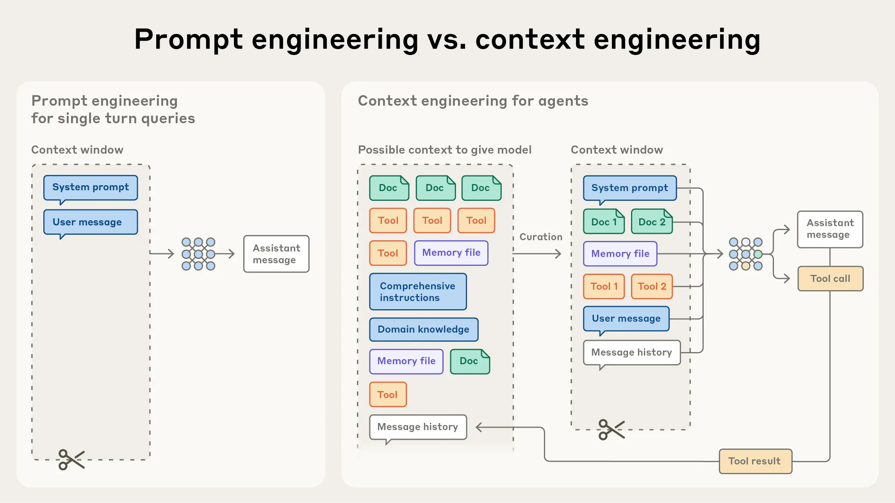
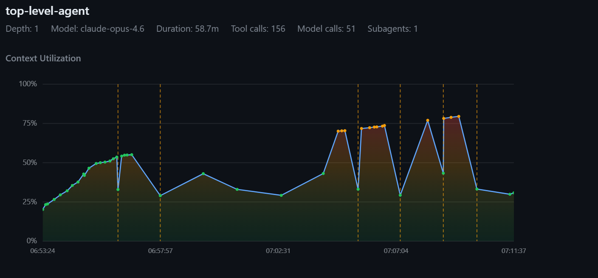
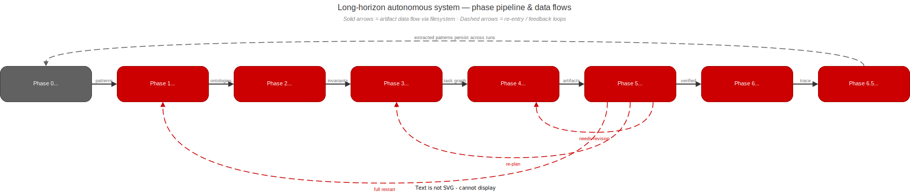
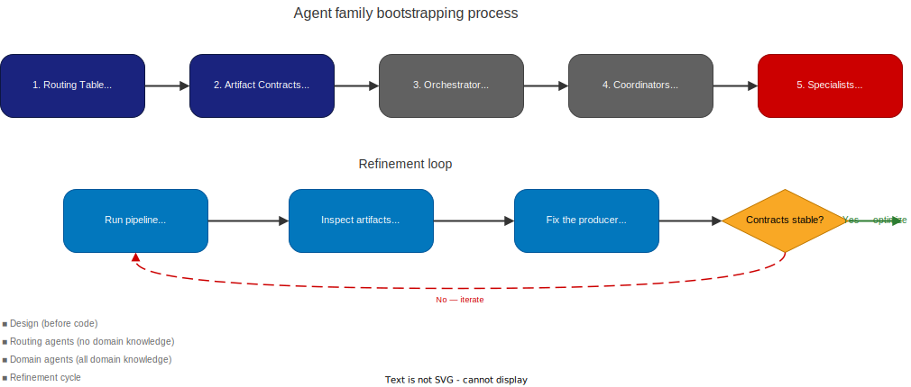

# Coordination mechanisms for long-horizon, self-converging, autonomous LLM systems 

This repository describes and showcases a large language model (LLM) coordination architecture I use to manage long-horizon agentic AI tasks.

A couple of definitions to get started:

> By **long-horizon**, I mean tasks that cannot realistically be completed in one short, uninterrupted reasoning session. They take many tool calls, many intermediate decisions, often multiple phases, and usually some amount of re-evaluation of earlier work. The problem is not just that they are large. It is that they stay large over time, while the model's context keeps changing underneath them, with key information entering and exiting, and the overall system entropy increasing due to inherent constraints and limitation of the LLM architecture.

> By **self-convergence**, I mean that the workflow has an internal mechanism for recognizing that the current result is still not good enough, feeding that back into an earlier stage in its processing, and repeating until some stability condition is reached, or the system hits some explicit bound. In practice, this is usually not some abstract philosophical property, but a loop. For example, a planner produces tasks, execution implements it, verification rejects or flags gaps, and that rejection feeds a replanning pass instead of just becoming a dead-end error that ends the model's turn, prompting human intervention.

> And by **autonomous**, I mean standalone and without supervision. The human bootstraps the environment, prepares some artifacts to drive the workflow -- think task description, references, instructions about the final desired state, all that fluff. Then, following this setup, there is only an initial impulse fed into the architecture -- usually a simple *begin* impulse -- after which the system is capable of independent work based on surrounding, self-managed context. It persists through transient API failures, crashes, timeouts, and is capable of resuming from any point without degrading its downstream state and resulting artifacts; It is not dependent on any single ephemeral, transient LLM context.

Table of contents:

- [Coordination mechanisms for long-horizon, self-converging, autonomous LLM systems](#coordination-mechanisms-for-long-horizon-self-converging-autonomous-llm-systems)
- [Primary constraints and assumptions](#primary-constraints-and-assumptions)
- [Problem area introduction](#problem-area-introduction)
  - [Key factors influencing the architecture](#key-factors-influencing-the-architecture)
    - [Harness](#harness)
    - [Context window](#context-window)
    - [Prompt "fragility"](#prompt-fragility)
  - [Declarative vs imperative prompting](#declarative-vs-imperative-prompting)
  - [The LLM "random walk"](#the-llm-random-walk)
- [Run of the mill agentic workflows](#run-of-the-mill-agentic-workflows)
  - [Single-agent workflow](#single-agent-workflow)
  - [Top-level-agent + subagent workflows](#top-level-agent--subagent-workflows)
  - [Result: Not good enough](#result-not-good-enough)
- [Context purity](#context-purity)
  - [What is it?](#what-is-it)
  - [Why it matters](#why-it-matters)
  - [Treating agents as functions](#treating-agents-as-functions)
- [Agent-as-function](#agent-as-function)
  - [The status file](#the-status-file)
  - [Routing](#routing)
  - [Separating control flow from data flow](#separating-control-flow-from-data-flow)
    - [Iteration and self-convergence](#iteration-and-self-convergence)
    - [The manifest as audit trail and recovery point](#the-manifest-as-audit-trail-and-recovery-point)
    - [Convergence criteria](#convergence-criteria)
    - [Adversarial agents and phase gates](#adversarial-agents-and-phase-gates)
  - [Generalizing to multiple nesting levels (the agent fractal)](#generalizing-to-multiple-nesting-levels-the-agent-fractal)
- [Declarative versus imperative prompting in autonomous systems](#declarative-versus-imperative-prompting-in-autonomous-systems)
- [Invariants](#invariants)
  - [The extraction problem](#the-extraction-problem)
  - [Invariant lifecycle in the pipeline](#invariant-lifecycle-in-the-pipeline)
  - [The invariant gate](#the-invariant-gate)
  - [Incremental extraction](#incremental-extraction)
  - [Domain generality](#domain-generality)
  - [Invariant supremacy in practice](#invariant-supremacy-in-practice)
  - [Invariant collision and scope boundaries](#invariant-collision-and-scope-boundaries)
  - [Second-order cascade effects](#second-order-cascade-effects)
- [Intermediate artifacts as a method of coordination](#intermediate-artifacts-as-a-method-of-coordination)
  - [Inputs](#inputs)
  - [Intermediate steps](#intermediate-steps)
    - [Initial discovery](#initial-discovery)
    - [Invariant extraction](#invariant-extraction)
    - [Task composition](#task-composition)
    - [Work](#work)
    - [Verification](#verification)
  - [Output artifacts](#output-artifacts)
  - [Data representation](#data-representation)
    - [Markdown](#markdown)
    - [JSON](#json)
    - [SQL](#sql)
  - [Alternatives](#alternatives)
- [Context engineering](#context-engineering)
  - [Prompt guards](#prompt-guards)
  - [Further generalization](#further-generalization)
- [Progressive disclosure](#progressive-disclosure)
  - [Workflow decomposition into phase skills](#workflow-decomposition-into-phase-skills)
- [Long-horizon autonomous system decomposition](#long-horizon-autonomous-system-decomposition)
  - [Phase 1 - Problem/Task analysis](#phase-1---problemtask-analysis)
    - [Prompt composition](#prompt-composition)
    - [Artifacts](#artifacts)
  - [Phase 2 - Invariant extraction](#phase-2---invariant-extraction)
    - [Prompt composition](#prompt-composition-1)
    - [Artifacts](#artifacts-1)
  - [Phase 3 - Planning](#phase-3---planning)
    - [Prompt composition](#prompt-composition-2)
    - [Artifacts](#artifacts-2)
  - [Phase 4 - Execution loop](#phase-4---execution-loop)
    - [Prompt composition](#prompt-composition-3)
    - [Artifacts](#artifacts-3)
  - [Phase 5 - Verification](#phase-5---verification)
    - [Prompt composition](#prompt-composition-4)
    - [Artifacts](#artifacts-4)
  - [Phase 6 - Handoff](#phase-6---handoff)
    - [Prompt composition](#prompt-composition-5)
    - [Artifacts](#artifacts-5)
  - [Phase 6.5 - Meta-knowledge synthesis and persistence](#phase-65---meta-knowledge-synthesis-and-persistence)
    - [Prompt composition](#prompt-composition-6)
    - [Artifacts](#artifacts-6)
  - [Phase 0 - Meta-knowledge curation](#phase-0---meta-knowledge-curation)
    - [Prompt composition](#prompt-composition-7)
    - [Artifacts](#artifacts-7)
- [Case studies](#case-studies)
  - [Docwriter](#docwriter)
  - [Migrator](#migrator)
  - [Fantasy writer](#fantasy-writer)
- [Fractal factory](#fractal-factory)
  - [Bootstrapping a new agent family](#bootstrapping-a-new-agent-family)
    - [Refine specialists based on output](#refine-specialists-based-on-output)
- [Debug](#debug)
  - [Known bottlenecks](#known-bottlenecks)
    - [Diagnostic approach](#diagnostic-approach)
- [Telemetry and observability](#telemetry-and-observability)
- [RAG and other meta-knowledge memory management systems](#rag-and-other-meta-knowledge-memory-management-systems)
- [Remarks](#remarks)
  - [Invariant confidence](#invariant-confidence)
  - [Routing tables](#routing-tables)
    - [Transition functions as routers](#transition-functions-as-routers)
    - [Extended finite state machines](#extended-finite-state-machines)
    - [Statecharts](#statecharts)
    - [Practical representation](#practical-representation)
  - [You don't actually need nested agents](#you-dont-actually-need-nested-agents)
    - [The alternative: flattening the hierarchy](#the-alternative-flattening-the-hierarchy)
    - [The spectrum](#the-spectrum)
  - [Algorithmization](#algorithmization)
    - [Prompts are pretty formulaic](#prompts-are-pretty-formulaic)
  - [Fully generalized fractal agents](#fully-generalized-fractal-agents)
    - [The bootstrap sequence](#the-bootstrap-sequence)
    - [What makes this different from AutoGen/CrewAI-style dynamic teams](#what-makes-this-different-from-autogencrewai-style-dynamic-teams)
    - [The spectrum of autonomy](#the-spectrum-of-autonomy)
- [llm-long-horizon-coordination](#llm-long-horizon-coordination)


# Primary constraints and assumptions

1. I'm a consumer, using consumer-grade tools.
2. I don't have access to hardware that can self-host 1 trillion+ param models.
3. I don't have the manpower to flesh out a ReAct harness from scratch, I'm reusing what's available - Claude Code, Copilot CLI, Codex... build on the shoulders of giants and all that.

So this is basically about how to structure agent workflows on top of existing coding harnesses like Copilot and Claude Code so they can stay coherent over longer runs. That includes how work gets decomposed, how agents hand state to each other, how much context the top-level controller should be allowed to carry, and how to keep the whole system from slowly descending to madness over time.

For long-running autonomous work, the cause is usually some combination of context window pressure, compaction behavior, and prompt fragility.

# Problem area introduction

> Skip this section if you're already familiar with these concepts. I'm introducing all of these as constituents of the problem I'm trying to solve. 

## Key factors influencing the architecture

There are a few things pushing the design in this repository.

### Harness

As said above, Copilot and Claude Code are already excellent general-purpose coding loops. That means the architecture here should not fight them. It should use them and the capabilities they provide to solve a different class of problem on top: how to structure long-horizon work so the harness stays effective for longer.

### Context window

This is probably the biggest one.

In a long autonomous session, the model reads files, calls tools, writes code, inspects outputs, thinks through errors, gets redirected, revises plans, (gets sidetracked by the human), and keeps accumulating material in context. Over time, earlier information gets pushed further and further back. Then compaction or summarization kicks in, and now the model is no longer operating over the original material anyway. It is operating over some compressed approximation of it.

A good way to think about this is the following diagram:

 

(image source: https://www.anthropic.com/engineering/effective-context-engineering-for-ai-agents)

That is where a lot of weird behavior comes from.

The model might still look like it “remembers” the task, but the quality of the connections it makes between old constraints and current decisions starts getting worse. Some details survive, others get flattened, and some are just gone. The longer the run, the more this compounds.

### Prompt "fragility"

People often try to fix the above by stuffing more instructions into the prompt. More rules, more workflow steps, more reminders, more reusable snippets, more skills, more agents, more scaffolding, using [progressive disclosure](#progressive-disclosure). Some of that helps. But there is a limit to how much imperative prompting can really solve. At some point you are just writing a bigger and bigger script and hoping the LLM follows it faithfully across a noisy multi-hour session. That is not a stable foundation. 

Before moving on, I wanna sidetrack with something I see mentioned from time to time in various LLM tutorials, materials, etc., but that never clicked with me until I observed the effects in action, and that is: 

## Declarative vs imperative prompting

Imperative prompting is the predominant way people interact with LLMs. An imperative prompt often drives the LLM to action:

- do this
- inspect that
- check these files
- debug this issue
- write this output
- compile this
- test that
- summarize what happened

In other words, the prompt is trying to directly control the agent’s action sequence.  

That works fine for shorter human-in-the-loop tasks. The user is around, the scope is bounded, and if the model forgets something you can redirect it.

But in longer workflows, imperative prompting gets brittle very quickly. The prompt is trying to serve as planner, scheduler, guardrail system, memory system, and quality control all at once. It takes one context summarization or memory compaction event to start breaking things down. From an ordered todo list of 10 tasks, the agent can suddenly focus on the latest 1 to 3, finish them, and proudly declare the work done while completely omitting the rest of the workflow.

Declarative prompting starts from a different place. Instead of describing the full sequence of actions, it describes the desired system state `B` given some starting state `A`.

The idea is not “first read this, then do that”. Instead, you give the system a list of declarative statements that are not really meant to induce a specific action sequence by themselves. The prompt contains, essentially, a list of observations:

- here is the source system
- here is the description of the desired state
- here are the constraints
- here is what must be satisfied
- here is what must remain true

And the workflow figures out how to move from one state to the other. You are giving up control over the **how**, the intermediate steps, in exchange for stronger control over the **what**. This is not especially powerful in isolation inside a single-agent system, but it becomes much more interesting once the workflow is no longer dependent on just one context window and one transient memory state.

## The LLM "random walk"

The last aspect of LLM interaction I want to establish before moving to the actual interesting topics is what everyone is likely intimately familiar with.

It looks roughly like this. You start a session, give the agent a prompt, sweat buckets making it as polished and perfect as possible, reference all the skills, link all the docs, cook the meta-instructions to perfection, and yet the end result still often looks something like this:


The prompt produces the initial foundation, but that foundation is brittle and easy to sidestep. The black line is what usually happens: a messy wandering path that sometimes lands somewhere useful, sometimes lands somewhere vaguely correct, and sometimes just drifts off. What we actually want when designing autonomous systems is something closer to:


So what do the constraints that bound the walk actually look like? That depends on the problem domain. In software engineering feature development, they might look like this:

- the project must compile without errors or warnings
- all tests must pass
- the code must follow some engineering guidelines such as proper patterns, abstraction usage, and interface boundaries
- coding style must remain consistent

For project documentation, it gets a lot fuzzier:

- the documentation solution compiles
- persona-centric style and language is maintained
- proper persona-specific documentation is produced
- API examples and code samples follow documentation standards (which often bend clean code standards and patterns in favor of readability)
- the output is structured according to existing semantic and structural preferences
- the output maintains the desired information architecture (diataxis, etc.)

For something like a fantasy book, the constraints get even more abstract:

- the produced artifacts follow genre conventions
- they maintain style and continuity
- they maintain consistent characters, arcs, locations, and events across tens of chapters
- character speech patterns are preserved, and relationship progression is reflected and evolved consistently

As is probably clear, both problem domain and problem scope can very quickly outscale the capabilities of simple agent to subagent workflows as complexity grows.

The constraints listed above are the *human-readable* version of the bounding envelope. In the architecture described later, these get formalized as **[invariants](#invariants)** — discrete, named, individually enforceable rules extracted from constraint sources and assigned unique IDs. Rather than hoping the agent "remembers" that dashes should use `--` or that `.Internal` APIs must not appear in documentation, each constraint becomes a machine-referenced rule like `INV-style-096` or `INV-general-012` that reviewers check against, workers apply, and gap hunters audit. The constraints stop being prose that the agent might or might not attend to and become a structured system that the pipeline enforces mechanically.

And that is really the punchline of this section: the harder part is not getting the model to move at all, it is getting it to move while remaining inside a useful constraint envelope. Once the desired state becomes more abstract, more distributed, or more phase-dependent, a single prompt stops being a strong enough bounding mechanism. That is the point where workflow structure starts mattering more than prompt polish, which is exactly where the [next section](#run-of-the-mill-agentic-workflows) picks up.

# Run of the mill agentic workflows

Before introducing the fractal architecture, it is worth examining the simpler approaches it replaces and understanding specifically where they break down.

## Single-agent workflow

A lot of this architecture starts from a pretty simple observation: a single agent can look surprisingly competent for a while and still be the wrong abstraction for the task. The problem is not that one agent cannot do analysis, planning, writing, review, and verification. It often can -- very well in fact. The problem is that asking the same agent to keep all of that in one continuously growing context creates too many conflicting responsibilities.

The agent has to:

- remember the original goal
- remember the constraints
- remember what it already found
- remember what it already changed
- decide what to do next
- evaluate whether that was correct
- recover from failures
- carry intermediate outputs forward

All of that happens in one thread, inside one context window, while the surrounding information keeps changing.

At first the model is still operating on the actual task. Later it is increasingly operating on its own summaries, partial recollections, and recent local context. The task is still technically the same, but the working representation of it has degraded.

We can observe it in practice by charting compaction events across agent lifetimes. Each event almost guarantees information loss, system entropy, and downstream output degradation. The agent loses sight of previously known facts, task structure, etc.  



(compaction events in a ~58 minute single-agent session)

## Top-level-agent + subagent workflows

The next obvious move is to split some of that work out into subagents. The intuition makes sense: if one context window is the problem, spawn specialist contexts and let them do narrower pieces of work.

That does help, but only up to a point.

The naive agent to subagent pattern still has a major flaw: the subagent may do its work in an isolated context window, but when it finishes, its findings usually get pushed right back into the main agent's context.

That means the main agent still gradually turns into a dumping ground for exploration results, review notes, implementation summaries, and partial findings from multiple child runs.


The important detail in this diagram is that both subagent calls eventually feed back into the same top-level context window, leading to the same doom loop of compaction -> summarization -> invocation with incomplete information -> task drift.

## Result: Not good enough

Neither single-agent nor naive subagent patterns solve the fundamental problem: [context degradation](#the-llm-random-walk) over long-horizon autonomous work. The single agent degrades from within; the subagent pattern reimports that degradation into the parent. Something structurally different is needed — a coordination mechanism that does not use context as the information channel between agents.

The goal is obvious. Move away from LLM context as the place for information flow between agents and subagents, which is where the concept of **context purity** comes into focus.

# Context purity

The previous sections established three compounding problems:

1. Context windows degrade over time. Compaction and summarization are lossy, and the longer a session runs, the more the agent's working representation of the task, its prompt, and its rules drifts from reality.
2. A single agent doing everything accumulates too many responsibilities in one context, and eventually starts operating on its own compressed recollections rather than actual information.
3. Splitting work into subagents helps during execution, but when the subagent finishes, its output gets pushed back into the parent's context.

So the problem is not just that one context window is too small. The problem is that the conversation itself is the wrong place to store and pass around the output of a long-horizon workflow.

## What is it?

> Tl;dr - agent context window is only fed information required for a single atomic step in the overall workflow. Afterwards, agent gets discarded, fresh instance spun up, repeat. Autonomously.

The idea is straightforward: an agent should only carry in its context the information it actually needs for its own job. Not everything the system has ever produced. Not the full output of every subagent it ever called. Just what it needs to make its next decision.

For a top-level agent (orchestrator, coordinator, whatever terminology you choose) whose main job is deciding what happens next in a workflow, that means it should not need the complete contents of every sub-task result. It should not be reading ten-page analysis reports just to figure out whether the analysis phase finished successfully.

What it actually needs is much smaller:

- did the last step finish
- did it succeed, fail, or produce something that needs revision
- what should happen next

Everything else, the detailed analysis, the actual code changes, the review comments, the verification reports, all of that is valuable, but it does not need to live inside the top-level agent's context. It needs to live somewhere the system can access it. Those are different things.

## Why it matters

The top-level agent is the component that survives the longest in any multi-step workflow. It is the one that sees the most transitions, the most subagent returns, the most accumulated state. If that agent is allowed to absorb the full detail of everything that happens underneath it, then it becomes the single biggest target for compaction loss.

Keeping the top-level agent's context clean is not about making the architecture look tidy. It is about making the agent that matters most, the one coordinating the whole run, more resistant to the exact failure mode that makes long sessions unstable.

It also makes the system easier to recover from crashes and failures. If the meaningful state of the workflow is stored externally rather than inside one agent's memory, then restarting that agent does not mean losing the state. The work products are still there. The progress information is still there. The agent can pick up where it left off instead of trying to reconstruct everything from a compacted conversation history.

## Treating agents as functions

In the naive model, a subagent is something you talk to. You give it a task, it does work, and it talks back. The conversation is the interface.

Under context purity, that conversational interface becomes a liability, because every word that comes back adds to the parent's context load. So the question becomes: what is the minimum interface between a parent and a child agent that still lets the system work?

The answer turns out to look a lot like a function call.

The parent provides a small input: what to do, maybe what to read, maybe some constraints. The child runs, does its work, writes its output externally, and returns a short structured signal. The parent uses that signal to decide the next step. It never touches the actual output.

This is **agent-as-function**. Literally. The agent <-> subagent interface is treated as a function with a defined input, a defined output location, and a bounded return value. The parent calls it, waits for the return, and routes based on the result. The substantive data flows outside the conversation entirely.

# Agent-as-function

The subagent writes its real output to the filesystem and returns exactly one short line to the parent:

```
Done. Status: completed, result: analyzed. Written to .ralph/artifacts/DOC-3141/analyst/status.json
```

That line is the only thing the parent ever sees.

## The status file

Each subagent also writes a `status.json` into its artifact directory. This is the contract between child and parent:

```json
{
  "agent": "analyst",
  "task_id": "3141",
  "status": "completed",
  "result": "analyzed",
  "summary": "Identified 3 API endpoints needing documentation.",
  "artifacts": ["analysis.md", "source-map.json"],
  "iteration": 1,
  "next_hint": "planner"
}
```

- `result` is a categorical code the parent routes on. Not a description.
- `summary` is for logs and debugging, not for the parent to reason over (~100 tokens max).
- `artifacts` tells downstream agents what files to read. The parent ignores them.
- `next_hint` is advisory, not authoritative.

The corresponding directory on disk looks like:

```
./artifacts/DOC-3141/
├── manifest.json              # append-only audit log (covered below)
├── analyst/
│   ├── status.json            # ← the only file the parent reads
│   ├── analysis.md            # detailed analysis (read by planner, not by parent)
│   └── source-map.json        # structured source data (read by coder, not by parent)
```

When the planner runs next, it reads `analyst/analysis.md` directly from disk. It does not receive that content through the parent.

## Routing

The parent's job reduces to a simple loop: dispatch a subagent, read its status, decide what to dispatch next. That decision is driven by a routing table, not by interpreting artifact content.

A routing table for a documentation workflow might look like this:

| After agent | Result code | Next action |
|---|---|---|
| analyst | `analyzed` | dispatch planner |
| analyst | `blocked` | stop, report blocker to user |
| analyst | `insufficient-context` | dispatch analyst again with broader scope |
| planner | `planned` | dispatch coder |
| planner | `needs-revision` | dispatch analyst again |
| coder | `implemented` | dispatch reviewer |
| coder | `failed` | dispatch coder again (up to max retries) |
| reviewer | `approved` | dispatch scribe (final output) |
| reviewer | `needs-revision` | dispatch coder with reviewer artifacts |
| reviewer | `rejected` | dispatch analyst again (full restart) |

The parent reads `status.json`, looks up `result` in the table, and dispatches the next agent. That is the entire decision process. It does not need to read the analysis to decide whether to plan. It does not need to read the review to decide whether to re-dispatch the coder. The result code carries exactly enough information for routing and nothing more.

In the parent's context window, after several phases, the accumulated history looks something like:

```
→ Dispatched analyst for DOC-3141
← Done. Status: completed, result: analyzed.
→ Dispatched planner for DOC-3141
← Done. Status: completed, result: planned.
→ Dispatched coder for DOC-3141
← Done. Status: completed, result: implemented.
→ Dispatched reviewer for DOC-3141
← Done. Status: completed, result: needs-revision.
→ Dispatched coder for DOC-3141 (iteration 2)
← Done. Status: completed, result: implemented.
→ Dispatched reviewer for DOC-3141
← Done. Status: completed, result: approved.
→ Dispatched scribe for DOC-3141
```

Eight lines instead of eight multi-paragraph reports. Downstream agents consume files directly from disk. File locations are provided either via `status.json` or baked directly in downstream agent prompts (each specialist agent is still bounded by its context window so dircetly consumes a limited subset of the overall artifacts generated by the full workflow).

## Separating control flow from data flow

At this point we can name the two channels clearly:

- **Control flow** is vertical. It goes from parent down to subagent and back up. It carries dispatch directives and result codes. It lives in the conversation.
- **Data flow** is horizontal. It goes from one subagent's artifact directory to the next subagent's input. It carries the actual work product. It lives on the filesystem.

The parent sits at the junction of the control flow but is deliberately excluded from the data flow. It never relays information from one subagent to another. It never summarizes one agent's output for the next. It just routes.

Example of the architecture:


the parent can survive arbitrarily long runs without its context degrading, because its context only grows by a few lines per phase transition rather than by the full volume of every subagent's work.

### Iteration and self-convergence

This pattern gets more useful when the workflow includes loops.

Take a coder-reviewer cycle. The reviewer should not send a long review back through the orchestrator, forcing the orchestrator to remember it and restate it later. The reviewer writes `output-v1.md`, updates `status.json`, and exits. The coder's second iteration reads the analyst artifact plus the reviewer artifact directly and produces `output-v2.md`.

This does two things.

First, it preserves full fidelity across iterations. No summarization step is needed between reviewer and coder. Second, it makes loop bounds explicit. Because every iteration is versioned and every run appends to a manifest, the system can tell whether it is actually converging or just going in circles.

### The manifest as audit trail and recovery point

There is a second file sitting alongside all those `status.json` files: `manifest.json`, at the root of the task's artifact directory. Every subagent appends one entry to it when it finishes. Nobody overwrites it. It is append-only.

After the coder-reviewer loop from the example above, the manifest might look like this:

```json
[
  {
    "agent": "analyst",
    "iteration": 1,
    "status": "completed",
    "result": "analyzed",
    "artifacts": ["analyst/analysis.md", "analyst/source-map.json"],
    "timestamp": "2025-09-14T10:02:17Z"
  },
  {
    "agent": "planner",
    "iteration": 1,
    "status": "completed",
    "result": "planned",
    "artifacts": ["planner/plan.md", "planner/task-graph.json"],
    "timestamp": "2025-09-14T10:04:43Z"
  },
  {
    "agent": "coder",
    "iteration": 1,
    "status": "completed",
    "result": "implemented",
    "artifacts": ["coder/output-v1.md"],
    "timestamp": "2025-09-14T10:11:08Z"
  },
  {
    "agent": "reviewer",
    "iteration": 1,
    "status": "completed",
    "result": "needs-revision",
    "artifacts": ["reviewer/review-v1.md"],
    "timestamp": "2025-09-14T10:13:22Z"
  },
  {
    "agent": "coder",
    "iteration": 2,
    "status": "completed",
    "result": "implemented",
    "artifacts": ["coder/output-v2.md"],
    "timestamp": "2025-09-14T10:19:55Z"
  },
  {
    "agent": "reviewer",
    "iteration": 2,
    "status": "completed",
    "result": "approved",
    "artifacts": ["reviewer/review-v2.md"],
    "timestamp": "2025-09-14T10:21:40Z"
  }
]
```

This serves two purposes.

**Debugging and observability.** After a run finishes, or while it is still running, anyone can open the manifest and see exactly what happened, in what order, how many iterations each loop took, and what each agent produced. The timestamps make it easy to spot phases that took unexpectedly long or ran suspiciously fast.

**Resilience to abrupt termination.** This is the more important one. LLM sessions crash. API calls time out. Containers get killed. The parent agent hits a compaction event and loses track of where it was. In all of those cases, the conversation history is either gone or unreliable. But the manifest and the individual `status.json` files are still on disk.

When the parent restarts, or when a new parent session is started for the same task, it does not need to reconstruct what happened from scattered artifacts. It reads the manifest, finds the last completed entry, reads that agent's `status.json`, and resumes routing from exactly that point. The artifacts from every completed phase are still intact. Nothing needs to be re-derived from a compacted conversation.

The manifest also makes loop detection concrete. If the parent sees three consecutive coder entries all with `result: implemented` followed by reviewer entries with `result: needs-revision`, it has a clear signal that the loop is not converging. It can stop, escalate, or try a different approach. Without the manifest, that information would be scattered across a compacted conversation where half the iterations may have already been summarized away.

### Convergence criteria

Self-convergence -- an internal mechanism for recognizing that the current result is not yet good enough and feeding that back into an earlier stage. The architecture implements this through two nested loops with explicit termination conditions.

The **inner loop** is the write→review cycle within a single task. A worker produces output, one or more reviewers evaluate it against inlined [invariants](#invariants), and if any reviewer rejects, the worker receives targeted feedback and tries again. This loop terminates when:

- **Converged**: all reviewers return `approved` — every inlined invariant passes. The task is done.
- **Stuck**: the attempt count hits the bound (typically 3). The task is marked `blocked` and escalated rather than looping indefinitely.

The **outer loop** is the gap-hunting→re-entry cycle across the pipeline. After all tasks in the execution phase complete, a [verification phase](#phase-5---verification) runs an adversarial audit: cross-reference integrity checks and a completeness scan against the full invariant inventory, change inventory, and discovery files. This loop terminates when:

- **Converged**: the gap hunter finds zero new gaps and all cross-references resolve. The pipeline is done.
- **Stuck**: the gap-hunting cycle count hits the bound (typically 3). Convergence is forced — remaining gaps are surfaced in the pipeline summary for human disposition.

The formal termination condition for the entire pipeline is the conjunction:

> **All tasks accepted by all reviewers** AND **gap hunter finds zero gaps** AND **all cross-references resolve** AND **all machine-checkable invariants pass validation**.

If any conjunct fails and retry bounds are not exhausted, the pipeline re-enters at the appropriate upstream phase. If bounds are exhausted, the pipeline completes with a degraded status that reports exactly what did not converge and why. The [manifest](#the-manifest-as-audit-trail-and-recovery-point) records every cycle, making it possible to distinguish genuine convergence (the system fixed everything) from forced convergence (the system gave up on specific items).

This is what separates self-convergence from simple retry logic. Retry logic re-runs the same operation hoping for a different outcome. Self-convergence feeds structured diagnostic information (which invariant failed, what the evidence was, what the gap hunter found) back through the appropriate upstream phase, so each iteration is informed by the specific failure of the previous one.

### Adversarial agents and phase gates

Both loops in the convergence mechanism rely on the same underlying pattern: **an LLM evaluating another LLM's output against explicit criteria.** This is a form of LLM-as-judge — dedicated evaluation agents that exist solely to find fault.

The architecture uses adversarial agents at two scales:

**Task-level reviewers** operate inside the inner loop. After a worker produces output for a single task, one or more specialized reviewers evaluate it. Each reviewer checks a different dimension — style compliance, factual accuracy, audience targeting, structural integrity — and produces per-[invariant](#invariants) pass/fail verdicts with concrete evidence. The worker never sees generic rejection ("this needs work"). It sees `INV-style-132 FAIL: paragraph 3 uses 'you must configure' — rewrite to avoid directing 'must' at the reader.`

The key design constraint for reviewers is that they must be **adversarial by default.** An LLM asked "is this good?" will almost always say yes — it is trained to be agreeable. The reviewer prompt must structurally prevent superficial approval. In practice, this means:

- The reviewer is given the inlined invariants as a **checklist**, not as guidelines. Every invariant must receive an explicit pass or fail verdict. There is no "overall looks good."
- The reviewer must cite **evidence** — the specific paragraph, line, or construct that passes or violates each invariant. A verdict without evidence is treated as invalid.
- The prompt explicitly says that approval with zero rejections is a valid outcome only if every invariant has a cited pass verdict with evidence. Blanket approval is structurally impossible.

This anti-laziness enforcement is not optional. Without it, the write→review loop degenerates into a rubber-stamp cycle: the reviewer approves everything on the first attempt, convergence looks fast, and the output quality is whatever the worker happened to produce. The per-invariant evidence requirement forces the reviewer to actually read and evaluate the output against each rule.

**Phase-level auditors** operate at the coordinator boundary. At the end of each coordinator's sub-workflow — after all its specialists have run — an auditor agent evaluates the phase's collective output before the coordinator reports success to the orchestrator. The auditor is the **gate**: if it fails, the coordinator dispatches remediation before advancing.

In a creative writing pipeline, for example, every coordinator dispatches its specialists and then runs a phase auditor:

| Phase | Auditor checks | Gate condition |
|---|---|---|
| Worldbuilding | Internal consistency across geography, magic, politics, culture, history | All world-bible files cross-reference without contradictions |
| Character | Protagonist arc viability, relationship dynamics, voice distinctness | Every character has a defined motivation and voice profile before appearing in dialogue |
| Plotting | Narrative tension arc, dual-arc integration, pacing | Every chapter outline has rising action and at least one scene that advances both the external plot and the romance arc |
| Drafting | Prose quality, POV consistency, continuity | No unresolved continuity errors, POV voice maintained within chapters |

The auditor pattern is structurally identical to task-level reviewers — it evaluates against criteria and produces pass/fail verdicts — but scoped to an entire phase's output rather than a single task. If the auditor fails, the coordinator can re-dispatch specific specialists to address the failures without restarting the entire phase.

This two-scale adversarial pattern (task-level reviewers + phase-level auditors) is what makes [convergence](#convergence-criteria) practical. Without task-level reviewers, individual outputs drift. Without phase-level auditors, the drift compounds across specialists and only gets caught by the [gap hunter](#phase-5---verification) multiple phases later — forcing expensive re-entry cycles that could have been prevented by a local gate.

The gap hunter itself is the third scale — it is the pipeline-level adversarial agent that catches everything the phase-level gates missed. Together, the three scales form a defense-in-depth: per-task quality enforcement, per-phase consistency enforcement, and per-pipeline completeness enforcement.

## Generalizing to multiple nesting levels (the agent fractal)

Once the orchestrator-specialist pattern works at one level, the same idea generalizes naturally, each node in an agent-subagent system can become an orchestrator for its own sub-workflow. So, in a depth-3 workflow, you would end up with something like:

- **orchestrator** -- top-level session that starts and manages the whole run
- **coordinator** -- the high-level specialist
- **subcoordinator** -- for when even more specificity is needed for complex domain solving
- **specialist** -- the leaf agents producing artifacts and progressing overall pipeline state

At each layer, the parent stays as pure as possible and the child layer absorbs the amount of domain detail appropriate to its scope. The deeper you go, the more concrete the work gets. The higher you stay, the more abstract and routing-oriented the reasoning gets.

This produces a pyramid of purity and abstraction.

At the top, the session orchestrator should know almost nothing about the task domain beyond which phase is complete and which one should run next. Mid-level coordinators know more about one slice of the workflow, but they still mostly route and aggregate. Leaf specialists are the ones that actually touch code, documents, tools, and source material.

That layered exposure is a form of progressive disclosure. Instead of giving one agent the whole problem and asking it to hold every constraint in its head for hours, and run against the ever present nemesis of context compaction, the system reveals only the amount of problem space that each layer actually needs.

# Declarative versus imperative prompting in autonomous systems

With this info in mind, I'd like to revisit the concept of declarative vs. imperative prompting discussed in the introduction here and apply it within the context of the discussed agent-as-function framework.

A quick refresher:

- **Imperative prompting** tells an agent what exact sequence of actions to perform: read this file, inspect that module, write a plan, run this test, summarize the result. 
  - Works, but weak to comapction events -> agent loses script, gets sidetracked, often needs human intervention to get on track

- **Declarative prompting** encodes the desired system/artifact end state.
  - Abstract, often results in meandering solutions that dont fully comply with desired end states.

The interesting observation here is that for complex tasks, you need to combine both approaches - a research session to plan the path, then a transition to an imperative step-by-step sequence for the actual implementation. 

With human-in-the-loop, this is trivial. You plan the workflow, output some intermediate artifacts -- plan files, task graphs, what have you -- and then switch your prompting style inside a fresh agent context.

Autonomous systems, on the other hand, need to gradually and fully independently transition from a discovery and path planning loop to a task-based implementation process that respects domain complexity and external + internal constratints (style guides, requriements, security policies).

Under the *agent-as-function* architecture, this has interesting consequences for information propagataion and progressive disclosure. 

As established, the top-level agent directing the entire workflow must remain pure and abstract. Usually, the only prompt it receives is a simple ***begin*** or ***continue*** -- the only information that is realistically encoded is the workflow state:

- **begin/continue** -- irrelevant, just something to satisfy harness input requirements and instantiate the loop. The top-level agent follows its script, disregarding the input.

A single agent in the middle of a workflow pipeline receives instructions in the form:

- given the current artifacts and task context
- produce the next valid artifact and status signal
- let the workflow decide what happens afterward

It then uses inputs from this intermediate state to inform its actions and produce the next set of artifacts.

To summarize: artifacts produced by upstream agents naturally turn into prompts for the downstream agents, slowly transforming abstract and declarative artifacts into more imperative, tanglible outputs.

> This is a super cool emergent feature of the architecture and mega nice!

Information and completness flows top down and downstream. From completely abstract to functionality indistinguishable from boots on the ground work.


# Invariants

Invariants are the single most impactful artifact in the pipeline. They deserve dedicated treatment -- they solve **how to enforce quality and policy constraints consistently across dozens of independent agents that never communicate with each other.**

In a human-driven workflow, constraints live in the operator's head and the documents they consult. When a human reviewer checks a code review against the style guide, they are performing constraint enforcement through training, memory, and judgment. This works because one brain holds the full picture.

In a multi-agent pipeline, every agent is a separate brain with a separate context window. No agent has the full picture. If each agent independently reads the style guide and extracts its own interpretation of each rule, the result is inconsistency: one agent interprets "use active voice" differently than another, one agent catches a formatting rule that another misses, and the final output reflects the union of multiple incomplete interpretations.

Invariants eliminate this by interposing a dedicated extraction step between the constraint sources and the agents that must follow them. A **specialist extraction agent** reads the raw constraint documents once, decomposes every prose guideline into distinct, testable rules, and assigns each a unique ID. From that point forward, no downstream agent reads the raw constraint documents — they all reference the same extracted inventory.

In the long-horizon autonomous workflow described in this document, this extraction is performed by a dedicated phase agent (Phase 2) as part of the pipeline. The entire process — from reading constraint files, through decomposition and classification, to writing the structured inventory — happens without human intervention. This is essential: the architecture exists specifically because we do not want human intervention at any step. Every mechanism described in this document — status files, routing tables, invariant extraction, selective inlining, adversarial gap hunting, re-entry cycles, meta-knowledge persistence — serves the same goal: the human provides the initial impulse and the constraint sources, and the system handles everything else autonomously.

Could invariant extraction be done manually, or semi-automatically with a human in the loop? Of course. You could pre-extract invariants by hand, review them, and feed a curated inventory to the pipeline. But that is a different operating model — one that trades autonomy for control. The architecture here deliberately places extraction inside the autonomous pipeline because it needs to handle changes to constraint sources (new style guide sections, updated security policies) without a human re-curating the inventory between runs.

## The extraction problem

Extracting invariants from prose guidelines is harder than it sounds. A single paragraph in a style guide might contain multiple independent rules:

> *"In summaries and multi-line comments (/// or /\* \*/), use punctuation as in any other sentence. For single-line comments, do not use a final period."*

This becomes two invariants:

```json
{
  "id": "INV-codesamples-001",
  "rule": "In summaries and multi-line comments (/// or /* */), use punctuation as in any other sentence.",
  "enforcement": "reviewer-checkable"
}
```

```json
{
  "id": "INV-codesamples-002",
  "rule": "For single-line comments, do not use a final period.",
  "enforcement": "machine-checkable"
}
```

The second rule is machine-checkable because it specifies a binary condition (period present or absent). The first requires judgment — what constitutes "punctuation as in any other sentence" depends on context.

The extraction agent makes these decomposition and classification decisions. It is the only agent in the pipeline whose output is interpretive rather than mechanical. Its prompt is deliberately declarative — "extract all enforceable rules" — because the extraction requires domain understanding that cannot be pre-scripted.

The constraint sources themselves are often informal — written by humans for humans, with inconsistent formatting, embedded context, and implicit assumptions. A typical invariant source file looks like this:

```markdown
## Invariants to follow

### Syntax and markup

1. Tables must always use the existing Liquid table syntax.
2.  tags must have title attributes filled out.
3. All dashes inside markdown files must use `--`. If a page uses
   preexisting `–` (en dash, U+2013) symbols, everything on the
   page must be converted to `--`.

### API boundaries

6. Pubternal API with the .Internal namespace suffix must never
   be implemented or showcased directly in the documentation or
   associated code samples.
7. If a task requires documenting public APIs from .Internal
   namespaces, raise this as BLOCKER and abort the task.

### Collection-specific restrictions

8. The _guides collection is off limits to modifications unless
   explicitly requested via context.json.
```

From this single file, the scanner extracts 10+ invariants with distinct IDs, domains, enforcement types, and applicability scopes. The numbered items sometimes contain multiple rules (item 3 contains both a formatting rule and a conversion rule). The scanner must decompose, classify, and structure all of them.

In the docwriter pipeline, 229 invariants are extracted from 8 style guide and convention files, distributed across 8 domains:

| Domain | Count | Examples |
|---|---|---|
| `style` | 92 | Voice, tone, punctuation, terminology, formatting |
| `jekyll` | 33 | Front matter, Liquid syntax, include patterns, layout rules |
| `codesamples` | 27 | Marker syntax, file organization, naming conventions |
| `structure` | 25 | Heading hierarchy, section ordering, page layout |
| `general` | 20 | Accessibility, linking standards, metadata requirements |
| `taxonomy` | 15 | Topic classification, persona tagging, navigation rules |
| `persona` | 9 | Audience targeting, technical depth, scenario framing |
| `crossref` | 8 | Cross-reference formats, anchor conventions, link resolution |

Of these, 82 (36%) are machine-checkable and 147 (64%) require reviewer judgment. Machine-checkable invariants are validated by automated agents (front matter validators, build checks, link resolution, deterministic build logic). Reviewer-checkable invariants are evaluated by specialized review agents that produce per-invariant pass/fail verdicts with evidence.

## Invariant lifecycle in the pipeline

An invariant follows a precise path from extraction to enforcement:

**1. Extraction** — The invariant scanner reads the style guide and produces `INV-style-132: "In second person, use 'you' to address the reader. Avoid using 'must' directed at people."` with `enforcement: reviewer-checkable`, `appliesTo: ["user-facing"]`.

**2. Selective inlining** — The task planner evaluates T-004 (a user-facing documentation page update). `INV-style-132`'s `appliesTo` matches the task's properties, so it is inlined into the task definition. The planner selects 22 of 229 invariants for this specific task.

**3. Worker application** — The content writer reads the task definition, sees `INV-style-132` in the inlined invariants, and writes the page using "you" in second person, avoiding "must" directed at people. The writer records in its output metadata which invariants it applied.

**4. Reviewer enforcement** — The style reviewer evaluates the page against the 22 inlined invariants. For `INV-style-132`, it checks every paragraph for violations. It produces a verdict: `PASS — all second-person constructions use "you," no instances of "must" directed at the reader.` Or: `FAIL — paragraph 3 uses "you must configure" which directs "must" at the reader. Use "configure the service by" instead.`

**5. Feedback precision** — If the reviewer rejects, the feedback contains the invariant ID and the specific violation. The worker receives not "the style is wrong" but "INV-style-132 failed: 'you must configure' in paragraph 3." This precision is what makes the write-review loop converge quickly — the worker knows exactly what to fix without re-interpreting the full style guide.

**6. Gap audit** — The gap hunter verifies that every invariant with `appliesTo: ["user-facing"]` was checked by at least one task that touches user-facing content. If `INV-style-132` was never inlined into any task (because the planner's scope matching missed it), the gap hunter catches the omission and triggers a re-entry cycle.

**7. Cross-run learning** — The task-signal analyzer records whether tasks with `INV-style-132` inlined had higher or lower first-attempt acceptance rates. Over time, this builds a usage profile that feeds back through the knowledge system — the planner learns that aggressively inlining style invariants for user-facing content reduces revision cycles.

## The invariant gate

One of the more subtle roles of the invariant inventory is as a filter for external inputs. When a pipeline includes a research phase (where agents fetch best practices from external sources), the recommendations pass through an **invariant gate** before reaching any execution agent.

The gate is simple: for each recommendation, check whether it conflicts with any existing invariant. If it does, the invariant wins unconditionally. The recommendation is either blocked entirely or adapted to comply with the invariant. The conflict and the resolution are logged.

This prevents a failure mode that is otherwise hard to detect: an external recommendation that is individually reasonable but violates an established constraint. For example, a documentation best-practice article might recommend "always use imperative mood in headings" — but if `INV-style-045` says "use sentence case with indicative mood in headings," the recommendation conflicts with the [extracted rule](#the-extraction-problem). Without the gate, the execution agent would see both instructions and make an unpredictable choice. With the gate, the invariant always wins.

## Incremental extraction

The invariant scanner uses a file-section hash map to avoid re-extracting unchanged content on subsequent runs. Each section of each constraint file is hashed. On re-extraction (including re-entry cycles where the constraints directory is unchanged), only new or modified sections produce new invariants. Existing invariants from unchanged sections are carried forward with their original IDs.

This is critical for cross-run stability. Invariants referenced in the knowledge base (patterns like "high invariant count correlates with first-attempt success") use invariant IDs. If re-extraction assigned new IDs to unchanged rules, the knowledge base references would become stale. Incremental extraction preserves ID stability across runs.

## Domain generality

The invariant pattern is not specific to documentation. Any domain with enforceable constraints benefits from the same decomposition:

- **Code migration** — security policies, framework standards, test coverage thresholds, backward compatibility rules
- **Legal analysis** — regulatory requirements, citation standards, jurisdiction-specific formatting rules
- **Game development** — performance budgets, API compatibility rules, platform certification checklists, content rating requirements
- **Academic writing** — journal formatting guidelines, citation style rules, statistical reporting standards

The schema is identical in every case. The `id`, `domain`, `rule`, `source`, `enforcement`, `appliesTo`, and `ephemeral` fields serve the same purpose regardless of whether the rule says "use active voice" or "maintain 60fps on target hardware." The pipeline's machinery — selective inlining, per-invariant review verdicts, gap hunting, cross-run confidence tracking — operates on the schema, not on the domain content.

## Invariant supremacy in practice

The most important [prompt guard](#prompt-guards) in the pipeline is **invariant supremacy**: when any external input — a domain fact from code analysis, a research recommendation, a discovery observation — conflicts with an extracted invariant, the invariant wins unconditionally.

This sounds obvious in the abstract, but the real-world cases are subtle. Here is an actual sequence from the docwriter pipeline:

**1. Code analysis produces a domain fact.** The code analyzer (a specialist that traces call chains and extracts behavioral rules from source code) identifies `IDateTimeNowService.GetDateTimeNow()` as the standard pattern for time operations in the codebase. It emits this as `FIND-051`: *"Use IDateTimeNowService.GetDateTimeNow() instead of DateTime.Now for testability — all reference implementations follow this pattern."*

This observation is factually correct — the codebase does use this service.

**2. The planner inlines the fact.** The task planner sees that T-001 (creating a page about scheduled task implementation) involves time operations. It inlines `FIND-051` as a `docFact` in the task definition.

**3. The writer follows the fact.** The content writer produces a documentation page showing `IDateTimeNowService.GetDateTimeNow()` as the recommended approach for time operations, per the inlined domain fact.

**4. The accuracy reviewer catches the conflict.** The reviewer traces the namespace: `IDateTimeNowService` lives in `CMS.Core.Internal`. It cross-references against `INV-general-012`: *"Pubternal API with the .Internal namespace suffix must never be implemented or showcased directly in the documentation."*

The reviewer's verdict:

> Internal Namespace Tension: `IDateTimeNowService` is in namespace `CMS.Core.Internal`. Conflict: FIND-051 mandates using it, but INV-general-012 prohibits .Internal APIs. Per Invariant Supremacy, INV-general-012 takes precedence.

**5. The writer self-corrects.** On re-dispatch, the writer receives the rejection with the specific invariant citation. It discards `FIND-051` entirely and replaces the time operations with `DateTime.UtcNow`, adding a testability tip recommending .NET's `TimeProvider` abstraction instead:

```json
"docFactDiscarded": [{
  "id": "FIND-051",
  "reason": "IDateTimeNowService lives in CMS.Core.Internal namespace.
    Per INV-general-012 (Invariant Supremacy), .Internal APIs must not
    be showcased. Replaced with DateTime.UtcNow + testability tip
    recommending .NET TimeProvider."
}]
```

**6. The reviewer confirms the fix:**

```json
"previousRejectionFixVerification": {
  "CODE-IMPORT-001": {
    "issue": "using CMS.Core; did not resolve IDateTimeNowService
      (lives in CMS.Core.Internal)",
    "fix": "IDateTimeNowService completely removed. All time
      references now use DateTime.UtcNow. Testability tip
      recommends .NET TimeProvider instead.",
    "verified": true,
    "evidence": "Full-text grep of document: zero occurrences of
      'IDateTimeNowService', 'CMS.Core.Internal', or 'CMS.Core'
      as import. IDateTimeNowService.cs line 3 confirms
      'namespace CMS.Core.Internal', so omission is correct
      per INV-general-012."
  }
}
```

The interesting thing about this sequence is that no human intervened. The code analyzer was correct in its observation — the codebase genuinely uses `IDateTimeNowService`. But the invariant (which encodes a policy decision: internal APIs must not be documented) overrides a factual observation. The pipeline resolved the conflict automatically through the invariant supremacy rule, and the final documentation correctly recommends public-API alternatives.

Without invariant supremacy, the conflict between FIND-051 and INV-general-012 would have been resolved by whichever instruction the writer happened to attend to more strongly in context — which, for an LLM, is nondeterministic and unreliable.

## Invariant collision and scope boundaries

Invariant supremacy handles conflicts between invariants and external inputs. But what happens when invariants collide with each other — or when fulfilling one invariant structurally prevents fulfilling another?

This is the harder design problem, and the pipeline handles it through explicit scope boundaries rather than priority ordering.

Here is an actual collision chain:

**INV-style-096** requires: *"All dashes inside markdown files must use `--`. If a page uses preexisting `–` (en dash, U+2013) symbols, everything on the page must be converted to `--`."*

**INV-structure-030** requires: *"The `_guides` collection is off limits to modifications unless explicitly requested via context.json."*

**INV-verification-001** requires: *"Before marking task as complete, the changes must pass the solution build (`npm run build`)."*

Now imagine the pipeline is updating a documentation page. The content writer normalizes a heading from `Attribute Tag Helpers – Images` to `Attribute Tag Helpers -- Images`, per INV-style-096. Other pages in the `_guides` collection contain anchor links pointing to the old heading text. The build now fails because the anchor references do not resolve — violating INV-verification-001.

But fixing the anchor references in the `_guides` collection would violate INV-structure-030.

The pipeline resolves this through its scope boundary mechanism. The cross-reference updater fixes the anchor references in pages within scope (the `_documentation` collection). For pages outside scope (`_guides`), the gap hunter files a **deferred task** rather than modifying the files:

```json
{
  "discoveryId": "DISC-XR-002",
  "type": "cross-cutting-concern",
  "summary": "En-dash (U+2013) characters remain widespread in _guides
    collection — 44+ files affected",
  "status": "out-of-scope",
  "notes": "INV-style-096 only requires conversion when a page is modified.
    _guides collection is not in scope per context.json contentCollections
    directive.",
  "suggestedAction": "Consider a future pipeline run targeting _guides
    collection for INV-style-096 en-dash remediation"
}
```

The resolution is principled: INV-structure-030 (scope boundary) takes precedence over INV-style-096 (formatting rule) for files outside scope. INV-verification-001 (build must pass) is satisfied by fixing references within scope. The out-of-scope issue is documented as a discovery for human disposition.

This pattern generalizes. When invariants create irreconcilable tensions, the pipeline does not silently pick a winner. It follows the scope boundaries encoded in the invariant inventory, resolves what it can within scope, and files deferred tasks for everything outside scope. The human sees a clear report of what was done, what was deferred, and why.

## Second-order cascade effects

Invariants create interesting second-order effects that neither the human author of the invariant nor the extraction agent anticipated.

The dash normalization chain is a clean example:

1. INV-style-096 says all dashes must use `--`
2. The content writer normalizes a heading: `Tag Helpers – Images` → `Tag Helpers -- Images`
3. The cross-reference updater detects broken anchors on other pages pointing to the old heading text
4. The updater fixes the anchors on those pages — which means those pages are now *modified*
5. Because those pages are now modified, INV-style-096 applies to them too — *all* dashes on the page must be normalized
6. The updater (or the gap hunter in the next cycle) discovers additional en-dashes on the newly modified pages and normalizes them

A single heading change in one file cascaded into dash normalization across multiple files. The invariant did not specify this — it said "if a page is modified, convert all dashes on the page." The cascade is an emergent consequence of scope expansion through cross-reference fixes.

The content writer's output metadata captures this precisely:

```json
"dashNormalization": "Converted 3 en-dashes (U+2013) on lines 31-33
  and 2 em-dashes (U+2014) on line 116 to -- per INV-style-096"
```

The gap hunter subsequently verifies that every modified page has been fully normalized:

```json
{
  "discoveryId": "DISC-XR-001",
  "status": "resolved",
  "notes": "store-files.md anchors fixed by cross-ref-updater in cycle 2.
    Verified: both lines 246 and 260 now use 'Attribute Tag Helpers -- Images'."
}
```

This cascade behavior is desirable — enforcement is mechanical and complete. But it also means that a single invariant can expand the pipeline's scope significantly beyond the original task. The [gap-hunting cycle mechanism](#phase-5---verification) handles this naturally: the gap hunter finds the cascaded work, triggers a re-entry cycle, the relevant phases re-run, and the pipeline converges on a state where all invariants are satisfied across all modified files.

> Also important CONSEQUENCE of this - ONE MUST BE EXTREMELY CAREFUL WHEN WRITING NEW INVARIANTS TO NOT INTRODUCE A CASCADING AVALANCHE. 
>
> An infinite cycle is impossible by design. But, if we take docwrite as an example, we could hypothetically slow a run down 10x by giving it some instructions that literally mandate updating every page in the target docu collections...

The broader observation is that invariants — through selective enforcement rules, scope boundaries, and cascade effects — make the pipeline's behavior *predictable* even when it is complex. Every action traces back to a named invariant. Every scope decision traces back to a scope boundary rule. The human who reads the manifest and the deferred tasks report can reconstruct exactly why the pipeline touched each file and why it deferred each unresolved issue. This auditability is what makes it possible to trust the system with autonomous execution over hundreds of files.


# Intermediate artifacts as a method of coordination

The agent-as-function pattern established that agents communicate through filesystem artifacts, not through context injection. But knowing that artifacts are the medium does not tell you what those artifacts should contain, how they compose, or how they transform as they flow through the pipeline.

This section traces the full artifact lifecycle: from the raw inputs that enter the system, through the intermediate transformations that refine and constrain them, to the final outputs that the human sees. Along the way, artifacts serve three roles simultaneously:

1. **Data carriers** — they hold the substantive information: what changed, what rules apply, what work needs doing, what the output looks like.
2. **Contracts** — their schemas define the interface between producer and consumer agents. A downstream agent does not need to know how the upstream agent works — it needs to know what the artifact contains and what shape it takes.
3. **Audit trail** — because every artifact is a file on disk with a known producer and a known schema, the complete decision chain is reconstructible after the fact. Why was this task planned? Because the impact matrix said X. Why did the impact matrix say X? Because the change inventory contained Y. Why did the change inventory contain Y? Because the diff included Z.

The artifact lifecycle maps directly to the phase pipeline described in the next section. Each phase consumes upstream artifacts and produces downstream artifacts. No phase modifies an artifact it did not create. No agent reads an artifact it is not listed as a consumer of. The flow is directed and auditable.

Let's break down how systems under agent-as-function get there.

## Inputs

Every pipeline run begins with three categories of input. These are the only external inputs — everything else is derived by the pipeline itself.

**Task description** (`context.json`) — the human-authored specification of what needs to happen. This is the only artifact that comes from outside the system — it is the initial bootstrap, the human's single point of contact with the pipeline.

The key design property of `context.json` is that it is entirely declarative. It encodes the desired end state and constraints, never the action sequence:

```json
{
  "task": "Update documentation for the new authentication API",
  "scope": {
    "collections": ["_documentation"],
    "productAreas": ["authentication", "security"]
  },
  "constraints": [
    "Focus on the developer persona",
    "All code samples must compile against the v14 SDK",
    "Do not modify pages outside the authentication section"
  ],
  "references": {
    "diff": "feature/auth-api-v2...main",
    "ticket": "DOC-3167"
  }
}
```

Notice: there are no instructions about what to do first, which agent to invoke, or what sequence to follow. The constraints describe what must be true about the output — the system figures out the path.

The shape of `context.json` varies by domain. A migration task might specify source and target frameworks, a creative writing task might reference world-building artifacts and chapter outlines, a code generation task might provide API specs and test expectations. But the declarative property is constant across all of them: the human describes the destination, not the route.

Task-scoped instructions embedded in `context.json` get extracted by the [invariant extraction phase](#phase-2---invariant-extraction) as ephemeral invariants (`TINV-*`) that apply only to the current run. "Focus on the developer persona" becomes `TINV-001` with `appliesTo: ["user-facing"]` and flows through the same selective inlining and per-invariant review machinery as permanent invariants.

**Domain-scoped constraints** — persistent rules that apply to every run in this workspace. Style guides, API conventions, security policies, accessibility requirements, architectural standards. These live in a constraints directory and are processed by the invariant extraction phase into a structured inventory. They are not read raw by execution agents — the extraction step is mandatory.

**Environment constraints** — properties of the execution environment that affect how work gets done:

- Security policies (authentication requirements, data handling rules)
- Platform conventions (framework-specific patterns, deployment configurations)
- Workflow ceremonies (version bumps, changelog updates, database migrations, CI/CD integration)
- Output format expectations (file organization, naming conventions, build system requirements)

Environment constraints are partially captured by the codebase orientation phase (which maps the workspace structure) and partially by invariant extraction (which processes any guideline files that encode environment rules). The key property is that environment constraints are stable across runs — they describe the workspace, not the task. 

## Intermediate steps

The pipeline transforms raw inputs into finished outputs through a series of intermediate artifacts. Each intermediate artifact narrows the solution space: discovery artifacts establish what exists, [invariants](#invariants) establish what rules apply, the [task graph](#task-composition) establishes what work to do, and review artifacts establish whether the work meets the rules.

### Initial discovery

Before any work can happen, the system needs to understand three things: the problem domain, the specific task, and the environment it is operating in.

**Domain ontology** — what is the subject area? A structured map of the problem space: modules, APIs, entities, relationships, technology stack. The specifics vary by domain — a codebase has modules and interfaces, a fictional world has characters and locations, a legal corpus has statutes and precedents — but the purpose is constant: give downstream agents a navigable map of the territory without requiring them to independently discover it.

**Task ontology** — what is being asked? The task description in `context.json` is usually human-authored and underspecified. The discovery phase parses it, identifies implicit requirements, cross-references against the domain ontology to find the scope boundaries, and produces a structured representation of what needs to happen. This includes identifying what changed, what already exists, and where the gaps are between the two.

**Environment ontology** — what constraints does the execution environment impose? Build systems, deployment pipelines, file organization conventions, framework configuration, CI/CD requirements, output format expectations. These are not task-specific — they apply to every run in this workspace.

All three are persisted as artifacts that downstream agents consume. The critical property is that each is derived once and read many times — no downstream agent re-derives the domain map or re-scans the corpus. On subsequent runs, previous ontology artifacts serve as warm-start inputs that only need incremental updates.

The discovery artifacts in a documentation pipeline illustrate the pattern:

- **`change-inventory.json`** (domain ontology) — every modified file categorized by product area, annotated with change type (added, modified, deleted), impact flags, and cross-references to the codebase map. The diff-analyzer produces this; the impact-mapper, task-planner, and gap-hunter all consume it.
- **`doc-index.json`** (task ontology) — every page in the documentation workspace indexed with front matter, heading structure, cross-reference graph, and topic cluster membership. The corpus-scanner produces this; the impact-mapper uses it to determine which pages need updates.
- **`codebase-map.json`** (environment ontology) — modules, APIs, dependency relationships, technology stack, and structural annotations. The codebase-surveyor produces a raw survey; the codebase-curator merges it into the persistent map. The code-analyzer and task-planner consume it.

Each artifact has a single exclusive producer and multiple consumers. The impact-mapper reads all three to build the impact matrix. The task-planner reads the impact matrix plus invariants to build the task graph. At no point does any agent re-derive information that an upstream agent already extracted.

### Invariant extraction

The second category of intermediate artifact is the [invariant inventory](#invariants) — the structured ruleset that governs every downstream decision. The full treatment of invariants — what they are, how they are extracted, how they flow through the pipeline — is covered in the [dedicated Invariants section](#invariants).

In the artifact flow, the key properties are:

- **Single producer.** The invariant scanner is the only agent that writes the inventory. No downstream agent modifies it.
- **Schema-contracted.** Every invariant follows the same JSON schema (`id`, `domain`, `rule`, `source`, `enforcement`, `appliesTo`, `ephemeral`), so every downstream consumer can parse it mechanically.
- **Selectively inlined.** The task planner evaluates each invariant's `appliesTo` scope against each task's properties and embeds only the relevant 15–30 invariants into each task definition. Workers and reviewers never see the full 200+ inventory.
- **Gated.** External recommendations (from research agents) are checked against the inventory before reaching execution agents. Conflicts are resolved in the invariant's favor — see [invariant supremacy](#invariant-supremacy-in-practice).

### Task composition

Task composition is the bridge between analysis and execution. It takes the outputs of discovery, invariant extraction, and impact analysis, and produces a dependency-ordered set of concrete work units — a task graph.

Each task in the graph is a self-contained work unit. It specifies:

- **What to do** — the action (create, update, delete, refactor, migrate) and the target (file, page, component, module)
- **What to know** — inlined facts from upstream analysis: extracted behavioral rules, relevant source material, domain-specific context. The analysis phase pre-selects and pre-shapes this information so the worker does not need to re-derive it from raw sources.
- **What rules to follow** — selectively inlined invariants. Not the full inventory, but the subset that applies to this specific task based on its properties and scope.
- **What to verify** — acceptance criteria, written concretely enough that a reviewer agent can evaluate them without interpretation.
- **What came before** — dependency edges to other tasks, ensuring ordering constraints are respected.

The task graph also carries metadata from the [knowledge brief](#phase-0---meta-knowledge-curation) (patterns from previous runs that predict success or failure for tasks of this shape) and approved research recommendations (filtered through the invariant gate). By the time a task definition reaches an execution agent, it contains everything that agent needs — pre-selected, pre-filtered, pre-scoped.

This is where the declarative-to-imperative transformation becomes concrete. The task description started as abstract constraints in `context.json`. After discovery, invariant extraction, impact mapping, and planning, it has been refined into a sequence of imperative instructions: "update this file, add these sections, apply these rules, satisfy these criteria."

### Work

The execution phase iterates over the task graph and runs a produce-then-verify loop for each task.

For each task, a worker agent receives the task definition and produces the output. The worker's context contains only the task definition and its direct dependencies — the existing file (if updating), relevant source material, and nothing else. It does not see other tasks, other workers' output, or the full pipeline state.

After the worker produces output, one or more reviewer agents evaluate it. Each reviewer is specialized: one checks compliance with domain rules (style, formatting), another verifies factual accuracy against source material, another checks audience targeting. Each reviewer produces per-invariant pass/fail verdicts with evidence.

If any reviewer rejects, the coordinator merges all feedback and re-dispatches the worker. The worker sees exactly what failed and why — specific invariant IDs with specific evidence. This targeted feedback is what makes the loop converge: it is not "this needs improvement" but "INV-style-132 failed because you used 'must' directed at people in paragraph 3."

Maximum attempts are bounded (typically 3). After the bound, the task is marked blocked rather than looping indefinitely. Blocked tasks are surfaced to the verification phase for triage.

### Verification

Verification is the pipeline's adversarial audit. It asks: did the execution phase actually cover everything?

Two distinct checks happen:

1. **Cross-reference integrity** — for systems where outputs reference each other (pages with links, modules with imports, chapters with narrative callbacks, components with dependency declarations), a verification agent scans all references and confirms they resolve correctly. Broken links, stale anchors, missing imports, unresolved references — anything that creates an integrity gap gets flagged.

2. **Completeness audit ([gap hunting](#phase-5---verification))** — an adversarial agent reads the original task scope, the change inventory, the task graph, all execution outputs, and the full invariant inventory. It hunts for: changes that were never documented/migrated, invariants that were never applied to any task, outputs that contradict the source material, and any other coverage gaps.

The completeness audit is zero-tolerance by design. There is no severity-based filtering, no "known follow-up items." If the gap hunter finds it, the pipeline addresses it — by triggering a re-entry cycle that resets the appropriate upstream phases.

This is where information also flows bottom-up. Specialist agents may have noticed things outside their task scope during execution — undocumented behaviors in adjacent code, missing coverage in pages they were not assigned to update. These observations are written as **discovery files** (a structured side-channel) that the gap hunter consumes during its audit. Without this mechanism, the audit would only check the planned scope against the planned work. With discoveries, the audit surface extends to everything any specialist noticed during the entire run.

## Output artifacts

The final output of any pipeline run is the set of targeted changes that satisfy the task description, the domain constraints, and the union of all extracted invariants. The concrete shape of these outputs varies entirely by domain — the architecture is agnostic about what the work product is.

But the output artifacts are not just the work product. The pipeline also produces:

- **`progress.json`** — the state machine snapshot. Every pass marked done/not-started, gap-hunting cycle counts, convergence status. This is the recovery point.
- **[`manifest.json`](#the-manifest-as-audit-trail-and-recovery-point)** — the append-only audit log. Every agent dispatch, every status transition, every re-entry decision, timestamped and traceable.
- **`pipeline-summary.json`** — the rollup. Tasks planned vs. written vs. blocked, cross-references verified, gap-hunting cycles, meta-knowledge produced.
- **Meta-knowledge entries** — patterns, anti-patterns, and domain insights persisted for future runs.

The work product files are what the human cares about. The coordination artifacts are what make the system debuggable, resumable, and improvable across runs.

## Data representation

The choice of data format in a multi-agent pipeline is not an aesthetic preference. It directly affects how much context each agent consumes, how reliably downstream agents can parse upstream outputs, and how efficiently the system recovers from crashes.

The core principle: **separate the control channel from the data channel.** Routing decisions (which agent runs next, what state are we in, did the last step succeed) flow through structured machine-readable formats. Substantive domain content (the actual work product, review feedback, domain analysis) flows through formats optimized for LLM comprehension and human readability.

### Markdown

Markdown is used for anything prose-heavy: task descriptions, review feedback, summary entries, discovery notes, and any work product that is primarily text. It is the natural format for content that humans will read and that LLMs produce fluently as unstructured text.

The key constraint is that Markdown artifacts are not used for coordination. No agent reads a Markdown file to make a routing decision. Routing decisions are driven by structured JSON status files. Markdown serves the data flow channel; JSON serves the control flow channel.

Markdown also serves as the format for knowledge entries, discovery files, and review narratives — places where the content is inherently unstructured and benefits from the LLM being able to write in natural prose rather than fitting observations into fixed schema fields. A review verdict might need to say "the third paragraph contradicts the API behavior described in line 47" — that is a natural language observation that would be awkward to encode as JSON.

The exception is front matter. Markdown files that participate in the coordination layer (knowledge entries, discovery files, research recommendations) use YAML front matter to carry structured metadata while keeping the body free-form. This gives routing agents their structured fields while preserving the prose body for downstream consumers.

### JSON

JSON dominates the coordination layer for a reason: current LLMs are extraordinarily fluent in it. Models produce valid JSON on the first attempt almost every time, parse it back without errors, and reason over its contents with high fidelity. They can also generate one-off `jq` commands, node scripts, or python snippets to query, transform, or merge JSON files when needed, without being told how.

Every routing artifact is JSON: `status.json` files, `progress.json`, `manifest.json`, `task-graph.json`, risk registers, signal files, index files. This means no agent ever has to parse free-form text to decide what to do next. The routing logic is always: read a JSON file, check a field, dispatch or continue.

JSON also carries the structured portions of data flow: change inventories, impact matrices, invariant inventories, code analysis outputs. These are artifacts that downstream agents need to cross-reference, filter, and join — operations that work naturally with structured data but would be fragile over prose.

The practical benefit is that schema violations are immediately visible. If an agent writes a status file missing the `result` field, the coordinator that reads it will fail deterministically rather than silently misinterpreting. Schemas are the contract between agents.

> Important caveat - the agent fails deterministically only if instructed by the prompt. Agent coordinators with any sort of recovery instructions can attempt retries until some determined failure bound is reached. Eg more than 3 failure loops, downstream agent reports 'blocked' again despite full workflow restart, etc.

One caveat: JSON files can grow large. An invariant inventory with 200+ entries, or a change inventory with 50 files, can overflow a context window if read in full. The mitigation is either (a) agents that produce large JSON also provide summary statistics in a status file, so coordinators never need to read the full artifact, or (b) the pipeline includes targeted query scripts that extract specific entries without loading the full file. The alternative — truncating or summarizing JSON — loses the structural guarantees that make it useful.

See the large-file handling skill for example 

### SQL

SQL databases are an interesting alternative that has seen limited testing. In principle, a relational store gives keyed access to task graphs, invariant inventories, and knowledge entries without loading entire files into context.

But in practice, the tradeoffs are unfavorable for agent-as-function architectures:

1. **Increased tool-call overhead.** Every read requires a query, which means the agent must formulate a SQL query, execute it, and parse the result — three tool calls where a single `read_file` would suffice. For large databases this may be worthwhile, but most pipeline artifacts are small enough that file-based access is faster.

2. **Opaque state.** A JSON file on disk is self-describing. A SQL database requires schema knowledge to query. When an agent crashes and the orchestrator needs to resume, reading `progress.json` is trivial. Querying the current pipeline state from a SQL database requires knowing the table structure, which is another thing the recovery logic must carry.

3. **No inherent versioning.** Append-only JSON artifacts (like `manifest.json`) provide a natural audit trail. SQL databases require explicit versioning columns, triggers, or WAL inspection — complexity that adds nothing to the agent's task.

4. **Crash resilience.** File-based artifacts survive crashes atomically — a file is either written or not. Partial SQL transactions require explicit rollback handling.

SQL may become more relevant as pipeline artifacts grow beyond what fits in a single context window, but for most practical pipelines, the file-based approach is simpler, more auditable, and better matched to LLM capabilities.

## Alternatives

The intermediate artifact approach is not the only way to coordinate multi-agent systems. Two common alternatives:

**Message-passing architectures** (e.g., CrewAI, AutoGen) coordinate agents through conversational exchanges — agents talk to each other, negotiate, and build shared understanding through dialogue. This works for brainstorming and collaborative reasoning but struggles with the same context accumulation problem described in earlier sections. Each message adds to every participant's context, and there is no clean separation between coordination signals and substantive data.

**Shared memory / blackboard systems** use a central data store that all agents can read from and write to. This is closer to the artifact-based approach, but without the strict producer-consumer contracts. Any agent can write to any location, which makes the system harder to audit and harder to resume after crashes — you cannot reconstruct the decision chain from a shared mutable store the way you can from versioned, append-only artifacts with explicit `generatedBy` fields.

The artifact-based approach trades flexibility for auditability and crash resilience. It is more rigid — agents must conform to artifact schemas, and data flow is explicit rather than emergent — but that rigidity is exactly what makes long-horizon autonomous execution tractable.

# Context engineering

In single-shot interactions, context engineering barely matters. The model gets a prompt, produces a response, and is done. In multi-hour autonomous pipelines, context engineering is the primary determinant of whether the system produces coherent output or drifts into subtle, compounding errors.

The core insight: **context degradation is not a bug to be patched. It is a physical constraint of the architecture.** Context windows are finite. Compaction is lossy. The longer an agent runs, the worse its representation of reality becomes. No amount of prompt polish prevents this. The only viable strategy is structural — designing the system so that context degradation damages as little as possible.

Three principles drive the approach:

1. **Minimize what enters context.** Every agent reads only the artifacts it needs. A reviewer does not read the change inventory. A worker does not read the gap analysis. The input contract is specified in the prompt, and the agent's tool use is bounded by that contract.

2. **Maximize the signal-to-noise ratio of what does enter.** Artifacts are pre-filtered and pre-aggregated by upstream agents. The task planner selects 15 relevant invariants out of 200+ and inlines them. The knowledge curator selects 20 relevant patterns out of 70+ and briefs them. The downstream agent never sees the unfiltered data.

3. **Make recovery from degradation cheap.** When compaction does hit (and it will), the agent's recovery path should be: re-read the input artifact, re-read the task definition, and continue. If the task definition contains everything the agent needs (inlined invariants, inlined domain facts, precise scope), then losing earlier context only loses the agent's recollection of intermediate reasoning — not the task itself.

The [agent-as-function](#agent-as-function) pattern implements all three. Each specialist starts with a clean context, reads exactly the artifacts its prompt specifies, does one job, and terminates. There is no context to degrade, because the context is populated fresh each time and scoped to a single task. Context degradation only matters for coordinators and the orchestrator — and their context contains only [status files](#the-status-file) and routing decisions, which are tiny.

## Prompt guards

Prompt guards are structural mechanisms embedded in agent prompts that prevent common failure modes before they compound. They are not corrections applied after failure — they are constraints that make certain categories of failure structurally impossible.

Several categories:

**Schema enforcement.** Every agent that writes a [JSON artifact](#json) is given the exact schema in its prompt. The agent does not decide what fields to include or how to structure the output — the schema is the contract. This eliminates an entire class of downstream parsing/noise/missing info failures.

**[Invariant supremacy.](#invariant-supremacy-in-practice)** When any directive, research recommendation, or discovered pattern conflicts with an extracted invariant, the invariant wins unconditionally. This is specified in every agent that handles external inputs. The conflict is logged, and the conflicting input is either blocked or adapted. Without this guard, well-intentioned external advice could silently violate established quality rules.

> Careful about the sources from which the majority of invariants gets extracted. Too narrow and you barely catch anything, too broad and it might constraint the output too much. Always depends on task domain though. For coding/documentation, the more constraints you put in the better. For something like prose writing, there is very high variety of outputs between too loose and too constrained.

**Bounded iteration.** Every loop in the system has an explicit maximum: 3 attempts per [write-review cycle](#phase-4---execution-loop), 3 [gap-hunting cycles](#phase-5---verification), bounded retry counts for failed tool calls. Without these bounds, a failing loop could consume unbounded compute without converging. The bounds are specified in coordinator prompts, not left to agent judgment.

**Read-before-write.** Agents that modify existing files are instructed to read the current content first. This prevents blind overwrites and ensures modifications are additive rather than destructive. Combined with the artifact versioning in `writer-output.json`, every change is traceable.

**Timestamp integrity.** Agents that write timestamps are instructed to run `date -u` in the terminal rather than guessing. LLMs are unreliable at generating accurate timestamps from training data. This is a small guard that prevents a surprisingly common class of artifact corruption.

**Discovery containment.** Execution agents that notice [out-of-scope observations](#initial-discovery) write them to discovery files rather than expanding their own task scope. The execution coordinator's prompt explicitly says not to read or modify discovery files — they are exclusively consumed by the gap-hunter. This prevents scope creep during execution while preserving the observations for the completeness audit.

**Zero-yap protocol.** In a multi-hour autonomous pipeline, the top-level orchestrator spends most of its life waiting — dispatching a coordinator, waiting for it to finish, reading its status file, updating progress, dispatching the next one. Between these dispatches, the orchestrator has nothing meaningful to say. 

But LLMs are trained to produce text, and an idle orchestrator with a growing context will start narrating: recapping what just happened, explaining what it is about to do, summarizing the routing table, or producing status reports nobody asked for. This is not just noise — it is actively dangerous. Every token of narration enters the context window and displaces signal. 

Worse, after enough idle turns of producing only text with no tool calls, the model can convince itself the task is "done" or that it should stop and ask the user for guidance. In long pipelines, this manifests as the orchestrator spontaneously terminating mid-workflow — not because of an error, but because it ran out of things to narrate and interpreted the silence as completion.

The zero-yap protocol eliminates this by imposing a hard structural constraint: **every orchestrator response must contain a tool call.** No exceptions. If the orchestrator would produce a text-only response, it must instead find a tool call to make — there is always a status file to read, a progress file to update, or a coordinator to dispatch. The protocol bans narration, summaries between passes, thinking out loud, and status reports unless the pipeline is fully complete or halted on error. The orchestrator becomes a pure state machine: read state, update state, dispatch next action. The manifest file serves as the audit trail, not the orchestrator's output stream.

This has a secondary stabilizing effect: by requiring a tool call on every turn, the orchestrator stays in "acting" mode rather than drifting into "reflecting" mode. The model's attention remains on the routing table and the current pipeline state rather than on generating increasingly ungrounded commentary about what it thinks is happening. The result is that orchestrators running under zero-yap reliably complete multi-hour pipelines that would otherwise terminate.

## Further generalization

Take any single fractal workflow, hide it behind an MCP call, or add another orchestration layer, and you get:


At this point, the only thing you are realistically bounded by are invocation cost and available hardware. Every decomposable workflow can be emulated using this architecture, provided the input/output contract between the fractal families is well-curated and structured.

> Pretty much every orchestrator tree can be hidden under a single node in a generalize/simplified/collapsed agent<->subagent tree.

# Progressive disclosure

Not every agent needs to see the full workflow at all times. Progressive disclosure applies to agent prompts the same way it applies to user interfaces: show only what is relevant to the current phase, and load the rest on demand.

## Workflow decomposition into phase skills

Consider an eight-p`hase documentation workflow. The main skill file is a compact router — a single table mapping decomposing workflow phases to skill reference files:

| Phase | Reference file | Summary |
|-------|---------------|---------|
| 1. Setup | `references/1-setup.md` | Branch, scratchpad, prior work search |
| 2. Research | `references/2-research.md` | Dispatch researcher, then planner to produce task files |
| 3. Write | `references/3-write.md` | Dispatch writer for the active planned task |
| 4–5. Review | `references/4-review.md` | Multi-reviewer gate, revision loop if needed |
| 6. Commit | `references/6-commit.md` | Pre-commit checks, commit, push |
| 7. PR | `references/7-pr.md` | Create pull request |
| 8. Handoff | `references/8-handoff.md` | Dispatch scribe, deliver results, exit |

The agent never loads all eight reference files at once. At any given moment it has read exactly one — the file for its current phase. When it finishes a phase, it updates `state.md`, returns to the router table, and reads the next reference file.

So the agent context only really requries the routing table and the phase number to survive compaction events. Afterwards, the agent simply picks back up by rereading the phase file, and it's back on track.

Not 100% reliable, but still way better than hoping the entire workflow survives from the agent prompt injected at the beginning of the lifecycle.

# Long-horizon autonomous system decomposition

Any sufficiently complex autonomous workflow decomposes into a pipeline of 5–7 phases. The exact number varies by domain complexity, but the shape is consistent: understand the problem, extract constraints, plan the work, execute it, verify it, deliver it, and optionally learn from it.

The phases form a directed graph with a single forward path and explicit re-entry edges. Re-entry is always triggered by verification failure — the gap-hunter finds something, sets a `reEntryTarget`, and the orchestrator cascade-resets the target phase and everything downstream.



The following breakdown describes each phase in terms of its purpose, the prompt composition style appropriate to its position in the pipeline, and the artifacts it produces. The phase structure is domain-independent — the same pipeline shape applies whether the domain is documentation, code migration, creative writing, data pipeline construction, or any other decomposable long-horizon task.

## Phase 1 - Problem/Task analysis

Phase 1 establishes the starting state. The human provides [`context.json`](#inputs) — the declarative bootstrap artifact introduced in the Inputs section. Phase 1 consumes it and runs the discovery pipeline that makes everything downstream possible.

For complex domains, `context.json` can carry significantly more structure than the minimal example shown earlier. A migration task, for instance, might specify full source and target framework descriptions:

```json
{
  "source": {
    "codePath": "<somePath>",
    "appUrl": "http://localhost:3000",
    "notes": "Jekyll site with Ruby plugins, custom Liquid tags, LESS+Tailwind hybrid CSS, Algolia search (frontend+backend indexing), RSS/sitemap custom generators, Learn Portal with localStorage client logic"
  },
  "target": {
    "framework": "NextJS 16 + App Router, following modern web dev practices. Tailwind 4 for styles, TypeScript for business logic.",
    "outputDirectory": "<somePath>",
    "testFramework": "Vitest and Playwright, basically the default Next stack"
  },
  "constraints": [
    "Nginx reverse proxy must stay as is even for the Next site.",
    "Every converted chunk must follow latest 2026 nextjs webapp best practices, correlated with internet sources",
    "All user flows on the live site must be tested using playwright and verified",
    "Each landing page must have screenshots from source and target proving identical styling",
    "Learn Portal client logic must go against an interface to swap out storage for Prisma in the future.",
    "All markdown documentation content must be migrated to MDX.",
    "Feature parity 1:1 including all user flows.",
    "Every implemented flow must be tested via playwright."
  ]
}
```

The same declarative property holds — these are all desired-state constraints, not action sequences. The migration pipeline decomposes them into slices, invariants, and tasks autonomously.

Phase 1 runs the bootstrapping: discovery agents that scan the source material and the existing output landscape, orientation agents that map the working environment. These produce the foundational artifacts — inventories of what changed, indexes of what exists, structural maps of the source material — that every downstream phase will reference.

### Prompt composition

The Phase 1 coordinators receive `context.json` directly. Their prompts are semi-declarative: they know which specialists to dispatch and what outputs to expect, but they do not know how each specialist does its work. A discovery coordinator knows that specialist A produces a change inventory and specialist B produces an output index — it validates both and writes a status file.

The specialist prompts within Phase 1 are the most declarative of any execution agent — they are told "scan this directory" or "index this workspace" without being told what to look for. The domain is too variable to prescribe.

### Artifacts

**`context.json`** — the human-authored task description and constraints. Read by every coordinator.

**`change-inventory.json`** — structured inventory of what changed in the source material, categorized by area, annotated with change types and impact flags.

**`output-index.json`** / **`source-map.json`** — complete index of the existing output landscape, with structural metadata, cross-reference graphs, and topic/module clustering.

**`environment-survey.json`** — structural map of the working environment: modules, interfaces, dependencies, and task-relevant annotations.

## Phase 2 - Invariant extraction

Phase 2 reads all constraint sources and produces the [invariant inventory](#invariants). This phase is covered in depth in the dedicated Invariants section — here, just the phase-specific mechanics.

The extraction is incremental: a hash map tracks which sections of which files have been processed, so re-runs only process changed or new sections. Three categories emerge: permanent invariants (`INV-*`) from persistent guidelines, task-specific invariants (`TINV-*`) from the current `context.json`, and derived invariants that emerge from combining domain analysis with constraint sources.

The invariant inventory is the most widely consumed artifact in the pipeline — read by the task planner (for [selective inlining](#invariant-lifecycle-in-the-pipeline)), all reviewers (as the evaluation checklist), validation agents (for machine-checkable enforcement), gap hunters (for completeness verification), and research agents (as the [invariant gate](#the-invariant-gate)).

### Prompt composition

The extraction agent receives a purely declarative prompt: the path to the constraints directory, the hash map from any previous run, and the instruction to extract all enforceable rules. It is given the output schema but not told what to look for — the extraction is inherently interpretive and domain-variable.

### Artifacts

**`invariant-inventory.json`** — the complete list of extracted invariants with ID, domain, rule text, source provenance, enforcement type, applicability scope, and ephemeral flag.

**`invariant-hashmap.json`** — per-section hashes of all processed constraint files for incremental re-extraction.

## Phase 3 - Planning

Phase 3 transforms the analytical outputs from Phases 1 and 2 into a concrete execution plan. This is where the declarative-to-imperative transformation happens most visibly — the input is a set of impacts, invariants, and domain models; the output is a dependency-ordered list of tasks that execution agents can carry out without further interpretation.

Two agents typically run in this phase:

1. **Task planner** — reads the impact matrix, invariant inventory, source analysis, knowledge brief, and approved research recommendations. Produces a `task-graph.json` where each task is fully self-contained: action, target, scope, inlined invariants, inlined domain facts, acceptance criteria, and dependency edges.

2. **Risk analyzer** — assesses each planned task across dimensions relevant to the domain. Produces a `risk-register.json` that the execution coordinator uses for ordering decisions (high-risk tasks first, when the pipeline has the most capacity for re-work).

The task planner performs a critical function: **[selective invariant inlining](#invariant-lifecycle-in-the-pipeline)**. Rather than passing the full 200+ invariant inventory to every execution agent, the planner evaluates each invariant's `appliesTo` scope against each task's properties and embeds only the relevant subset. This keeps downstream context windows focused and makes the reviewer's job tractable — it checks 15–30 inlined invariants, not 231.

### Prompt composition

The planning coordinator's prompt is semi-declarative: it knows the dispatch order (task-planner first, then risk-analyzer) and the validation rules (every impact must be covered by at least one task, every task must have acceptance criteria). It does not know how to plan.

The task-planner's prompt is where the system transitions to imperative. It receives concrete instructions: read these specific artifacts, cross-reference impacts against tasks, inline these invariant types, produce this exact JSON schema. The planner's output is the most imperative artifact in the pipeline — each task definition reads like a work order.

### Artifacts

**`task-graph.json`** — dependency-ordered task list. Each task contains action, target, scope, inlined invariants, inlined domain facts, acceptance criteria, dependencies, and relevant patterns from the knowledge brief.

**`risk-register.json`** — per-task risk assessment across domain-specific dimensions, with mitigations and ordering recommendations.

## Phase 4 - Execution loop

Phase 4 iterates over the task graph and runs a produce-then-review cycle for each task. This is where the actual work happens.

For each task:

1. A **worker agent** receives the task definition (with all inlined context) and produces the output. Its context window contains only what it needs for this specific task — the task definition, the existing file (if updating), and relevant source material.

2. One or more **reviewer agents** evaluate the output independently. Each reviewer is specialized by domain: style compliance, factual accuracy, audience targeting. Each produces per-invariant pass/fail verdicts with concrete evidence.

3. If any reviewer rejects, the coordinator merges all feedback into a single feedback file and re-dispatches the worker. All reviewers re-run on the revision — this prevents fixing one category of issue from regressing another.

4. Maximum attempts are bounded (typically 3). After exhausting attempts, the task is marked `blocked` rather than looping.

The execution coordinator also handles re-entry from gap-hunting cycles. When the pipeline re-enters Phase 4 after gap-hunting finds issues, the coordinator only re-runs affected tasks (identified by `affectedTaskIds` in the gap analysis), preserving completed work.

### Prompt composition

The execution coordinator's prompt describes the dispatch loop, the review aggregation logic, and the attempt bounds. It is procedural but not domain-specific — the same coordinator structure works regardless of what the workers are producing.

Worker prompts are fully imperative: read this task definition, read the existing file at this path, apply these invariants, produce this output, write this status file. There is no ambiguity.

Reviewer prompts are structured as evaluation rubrics: for each inlined invariant, check compliance and report pass/fail with evidence. The reviewer does not decide what to check — the inlined invariants are the checklist.

### Artifacts

**Work product files** — the actual outputs, whatever the domain produces.

**`worker-output.json` per task** — structured metadata about what was produced: what was modified, what was added, which invariants were applied, which domain facts were used, attempt notes.

**`*-review.json` per task per reviewer** — per-invariant verdicts with evidence. The gap-hunter and signal analyzers read these downstream.

**`review-feedback.md`** — merged reviewer feedback for rejected tasks, consumed by the worker on re-dispatch.

## Phase 5 - Verification

Phase 5 is the adversarial audit phase. It asks whether the execution phase actually covered everything, and whether the outputs maintain integrity.

Two sub-phases:

1. **Cross-reference verification** — a verification agent scans all outputs that reference each other and confirms every reference resolves. The specific reference types vary by domain (links, imports, narrative callbacks, dependency declarations), but the check is structural: does every outgoing reference have a valid target? The output is a `verification-matrix.json` with per-unit reference counts and validity.

2. **Gap hunting** — an adversarial agent reads the original scope, the full change inventory, the task graph, all execution outputs, the invariant inventory, knowledge brief patterns, and all discovery files. It hunts for: undocumented changes, unaddressed impacts, invariants that were never checked, stale content, and coverage gaps.

> Context alarms blaring here, clearly. If anticipated task scope too large, should decompose into multiple gap hunters, each focused on specific domain. Collected artifacts then all must read 'passed', otherwise pipeline enters another discovery/refinement cycle.

The gap hunter's output includes a **convergence assessment**: were gaps found? If so, which upstream phase must re-run to fix them? This triggers the [re-entry mechanism](#iteration-and-self-convergence) — the orchestrator cascade-resets the target phase and all downstream phases, and the pipeline loops.

The gap hunter also consumes **discovery files** — observations that specialist agents made during execution about things outside their task scope. This extends the audit surface beyond planned work to include everything any agent noticed during the run.

Maximum cycle count is bounded (typically 3). After exhaustion, convergence is forced.

### Prompt composition

The verification coordinator's prompt describes the two-pass structure (cross-refs then gap-hunting) and the convergence decision logic. The gap hunter's prompt is the most context-heavy in the pipeline — it reads nearly every upstream artifact. But its task is focused: find gaps along a specific taxonomy of gap types.

### Artifacts

**`verification-matrix.json`** — cross-reference validity report. Per-page/per-module link counts, broken references, anchor validity.

**`gap-analysis.json`** — gap inventory with convergence assessment. Each gap has a type, evidence, affected tasks, and suggested re-entry target. The `convergenceAssessment` section drives the orchestrator's re-entry decision.

## Phase 6 - Handoff

Phase 6 prepares the pipeline's output for human consumption. After verification has converged and all gaps have been addressed, the handoff phase runs final validation and produces delivery artifacts.

**Machine-checkable validation** — invariants with `enforcement: "machine-checkable"` that were not caught during the review cycle are checked programmatically. The specific checks are domain-dependent (schema validation, compilation, lint checks, test execution, build readiness), but the mechanism is uniform: run the check, report pass/fail per invariant.

**Summary generation** — a summary agent reads the full execution history and produces a human-readable description of everything that was created, updated, and fixed. This is organized by product area or functional domain, not by internal task ID.

**Pipeline summary** — the final `pipeline-summary.json` with aggregate statistics: tasks planned/written/blocked, gap-hunting cycles, cross-references verified, meta-knowledge produced.

### Prompt composition

Handoff agents are the most constrained in the pipeline. The validation agent's prompt is essentially a schema definition. The summary writer's prompt is a template with slots filled from upstream artifacts. There is almost no interpretive latitude — these are formatting and assembly tasks.

### Artifacts

**Validation results** — per-file/per-unit validation with pass/fail and issue details.

**Summary / release notes** — human-readable description of all changes.

**`pipeline-summary.json`** — aggregate statistics for the full run.

## Phase 6.5 - Meta-knowledge synthesis and persistence

Phase 6.5 is the learning system. It runs only after verification has fully converged — ensuring it analyzes the final state of all artifacts rather than intermediate revision states.

Two signal analyzers extract structured observations from the completed run:

1. **Task-signal analyzer** — examines per-task execution data to identify patterns: which task shapes (action type, target type, scope, complexity) succeed on the first attempt, which invariants are most frequently cited in rejections, which patterns from the knowledge brief were applied and with what effect.

2. **Context-signal analyzer** — examines pipeline-level data: gap-hunting patterns (were gaps predictable from available data?), research effectiveness (what fraction of recommendations were actually cited in outputs?), domain insights (which areas of the problem space generate the most work?).

A **knowledge integrator** merges both signal sets into the persistent knowledge base with confidence calibration. New observations start at low confidence, get promoted after multiple confirmations across runs, and are demoted or archived when contradicted by new evidence.

A **[skill rebuilder](#progressive-disclosure)** reconstructs skill reference files from the current knowledge base state, making the accumulated learning available to future pipeline runs through the curation phase.

### Prompt composition

Signal analyzers receive declarative prompts: here are all the execution artifacts, extract observations of these types. The analysis is interpretive — the agent must identify what constitutes a meaningful pattern in the execution data.

The knowledge integrator receives a more procedural prompt: merge these signals into the existing knowledge base using these confidence calibration rules. Quality gates (minimum confirmations, cross-run validation) are specified explicitly.

### Artifacts

**`task-signals.json`** — per-task execution statistics, rejection root causes, pattern observations.

**`context-signals.json`** — pipeline-level observations: gap predictability, research effectiveness, domain insights.

**`meta/index.json`** — updated persistent knowledge base with calibrated confidence levels.

**Skill reference files** — rebuilt from the current knowledge base for consumption by future runs.

## Phase 0 - Meta-knowledge curation

Phase 0 runs before everything else. It reads the accumulated knowledge base from previous runs and produces a focused brief for the current task.

Logically, this is Phase 0 because it depends on Phase 6.5 from a previous run — it consumes what the synthesis pipeline produced. On the first-ever run (cold start), the knowledge base is empty and the brief contains no patterns.

The curation agent scores every entry in the knowledge base against the current task profile using a weighted composite:

- **Domain overlap** (40%) — do the pattern's domains match the current task's domains?
- **Confidence** (25%) — has the pattern been confirmed across multiple runs?
- **Recency** (20%) — when was the pattern last observed?
- **Usage count** (15%) — how many runs have applied the pattern?

The output is a `knowledge-brief.json` capped at a fixed number of entries (typically 20), containing only the patterns, anti-patterns, and domain insights most relevant to the current task. This brief is then read by the task planner (for selective inlining into tasks) and the workers (as additional context alongside invariants and domain facts).

This phase is non-blocking — if curation fails, the pipeline proceeds without meta-knowledge.

### Prompt composition

The curator's prompt is declarative: here is the knowledge base path, here is the current task profile from `context.json`, produce a scored brief. The scoring weights are specified in the prompt, but the relevance evaluation is interpretive — the agent decides what constitutes domain overlap.

### Artifacts

**`knowledge-brief.json`** — scored subset of the knowledge base, containing `taskProfile`, `patterns`, `antiPatterns`, and `domainInsights` sections. Each entry carries `relevanceScore`, `confidence`, and `consumers` (which downstream agents should read it).

# Case studies

Each case study traces a complete pipeline run through the architecture described above, with real artifacts from actual executions.

## Docwriter

A fractal documentation pipeline — 32 agents organized as 1 orchestrator, 7 coordinators, and 24 specialists across a 10-pass workflow. Takes a git diff and a documentation workspace; produces publication-ready documentation pages, cross-reference fixes, and a changelog entry. Self-converges through a write→triple-review inner loop and a gap-hunting→re-entry outer loop. Maintains a persistent meta-knowledge base (73 entries after 4 runs) that feeds back into subsequent runs through three read channels: curated knowledge briefs, skill reference files, and direct meta reads. The case study walks through every pass with artifacts from an actual pipeline run (DOC-3167, 8 tasks, 2 gap-hunting cycles, zero blocked tasks), covers the cross-run persistence mechanism (confidence ladder, TTL decay, contradiction detection), and traces a single code change end-to-end from diff to published page.


[docwriter-case-study.md](case-studies/docwriter-case-study.md)

## Migrator

TODO

## Fantasy writer

Agent family for writing fantasy books (romantasy genre) given artifacts produced by an intial debrief session via a guide agent.

[fantasy-writer-case-study.md](case-studies/fantasy-writer-case-study.md)

# Fractal factory

Building a fractal agent family from scratch follows a repeatable process. The structure is consistent across domains — the variation is in the specialists, not the architecture.

## Bootstrapping a new agent family

The minimum viable fractal is five files: an orchestrator, one coordinator, two specialists, and a context file.

Start from the routing table. Define the phases of the workflow as a simple state machine in the orchestrator. Each phase maps to a coordinator (or a directly dispatched specialist for single-agent phases). The routing table is the first artifact because it makes the pipeline's shape explicit before any agent prompt is written.

Then define the artifact contracts. For each phase boundary, specify which artifacts flow downstream: what the phase produces, what the next phase consumes, and what schema each artifact follows. This is the contract layer — it exists before any agent knows how to do its job. The contracts prevent the most common failure mode in multi-agent systems: agents that produce output their consumers cannot parse, or consumers that expect fields their producers never write.

Then write the agents top-down:

1. **Orchestrator** — pure router. Reads `progress.json`, evaluates the routing table, dispatches the next coordinator. No domain knowledge, no data processing. The orchestrator's prompt is usually under 200 lines and changes rarely after the initial write.

2. **Coordinators** — sub-workflow routers. Each coordinator dispatches its specialists in order, validates their outputs, and writes a status file. Coordinators know the dispatch order and the validation rules for their phase but do not know how the work is done.

3. **Specialists** — leaf workers. Each specialist reads its defined inputs, performs one task, and writes its defined outputs. The specialist prompt is where all domain knowledge lives.

The top-down approach matters because it avoids a common trap: writing specialists first and then trying to wire them together. Specialists written in isolation tend to produce output shapes that do not compose well. When the routing table and artifact contracts exist first, each specialist is constrained to produce exactly what the downstream consumer expects.

### Refine specialists based on output

The first run of a new agent family is always rough. Specialist prompts are undertested, artifact schemas have edge cases, and the routing table may have ordering mistakes. The refinement loop is:

1. Run the pipeline end-to-end on a representative task
2. Inspect every artifact at every phase boundary — is the output what the next phase expects?
3. Identify where the pipeline broke or degraded: a specialist that produced malformed JSON, a coordinator that dispatched in the wrong order, a reviewer that checked the wrong invariants
4. Fix the broken agent's prompt, not the surrounding agents. The temptation is to add defensive parsing to the consumer — resist it. Fix the producer.
5. Re-run and repeat

After 2-3 iterations, the artifact contracts stabilize and the specialists produce consistent output. At that point, optimization shifts from correctness to efficiency: reducing unnecessary context consumption, merging specialists that are too granular, splitting specialists that do too much.

The practical heuristic for specialist granularity: if a specialist's prompt needs to reference more than 3 upstream artifacts, it is probably doing too much. If two specialists always run sequentially and the second only reads the first's output, they might be a single specialist. The goal is one responsibility per context window — not one tool call per context window.



# Debug

Debugging multi-agent pipelines is fundamentally different from debugging single-agent sessions. The failure surface is distributed across agents, and root causes often originate several phases upstream from where symptoms appear.

## Known bottlenecks

Three categories of failure dominate multi-agent pipeline debugging:

**Context overflow from large inventory files.** When an agent reads a full artifact that exceeds its effective context window, the result is not a clean error — it is silent degradation. The agent appears to process the file but misses entries near the middle or end. This is especially insidious with invariant inventories (200+ entries), change inventories (50+ files), and knowledge base indexes (70+ entries).

The root cause is agents using generic `read_file` on artifacts that were designed for machine consumption, not full-context loading. The mitigation is twofold: (a) provide targeted query scripts that extract specific entries by ID, type, or domain without loading the full file, and (b) design artifacts with summary statistics in their header so coordinators can make routing decisions without reading the body.

**High compaction frequency in long-running coordinators.** Coordinators that dispatch many specialists in sequence (execution coordinators handling 8-15 tasks) accumulate context with each dispatch-and-return cycle. After 5-6 cycles, compaction kicks in, and the coordinator starts losing track of which tasks are complete, which are blocked, and what the current re-entry state is.

The mitigation is the same principle that makes the orchestrator work: the coordinator re-reads [`progress.json`](#the-status-file) or its equivalent status tracking on every iteration. It does not rely on its own memory of past dispatches. The state is on disk, not in context.

**Cascading schema violations.** When a specialist produces a status file with a missing field or incorrect value, the coordinator makes a wrong routing decision, which propagates to the next specialist, which produces output based on incorrect assumptions. The error is usually not caught until the gap-hunter runs — 2-3 phases later — and the root cause is buried in a status file from much earlier.

The mitigation is coordinator-level validation: after each specialist returns, the coordinator reads the status file and checks required fields against the expected schema. If validation fails, the coordinator marks the specialist as failed and either retries or escalates, rather than continuing with bad state.

### Diagnostic approach

When a pipeline run produces incorrect output, the debugging process is:

1. Read the [manifest](#the-manifest-as-audit-trail-and-recovery-point). It contains every agent dispatch in order, with timestamps. Identify which dispatch produced the first incorrect output.
2. Read that agent's status file. Check whether the status correctly reflects what the agent actually did.
3. Read the agent's input artifacts. Were they correct? If the inputs were wrong, trace backward to the producing agent.
4. If inputs were correct but the output is wrong, the issue is in the agent's prompt or its context was degraded during execution.

The manifest-first approach works because the manifest is the single append-only log that survives every crash, compaction, and re-entry. It is the system's flight recorder.

For deeper inspection, the `cli-debug.log` (if the harness produces one) contains the raw tool-call sequence for each subagent invocation. Extracting subagent spans from this log reveals the exact sequence of reads, writes, and terminal commands the agent used — and where it deviated from the expected workflow.

# Telemetry and observability

The artifact-based architecture provides observability as a side effect. Every agent writes a status file. Every coordinator writes a status file. The orchestrator writes `progress.json` and appends to `manifest.json`. This means the entire execution history is on disk, in structured JSON, after every run.

Three levels of observability emerge:

**Run-level metrics** — extracted from `pipeline-summary.json` and the manifest. Tasks planned vs. completed vs. blocked. Gap-hunting cycles needed. First-attempt acceptance rate. Total review cycles. These are the top-line health indicators for a pipeline run. A first-attempt rate below 50% signals that the planning phase is under-constraining tasks. A gap-hunting cycle count at the maximum bound signals that the pipeline's verification and execution phases are not converging.

**Agent-level metrics** — extracted from individual status files and the manifest's timestamps. Per-agent execution time (time between dispatch manifest entry and status file write). Per-agent artifact sizes (read vs. write). Per-agent retry counts. These identify which agents are bottlenecks — an agent that takes disproportionately long is either doing too much work, reading too much context, or failing and retrying silently.

**Cross-run trends** — extracted from the knowledge base retrospectives (`meta/task-retros/`). First-attempt rate over time. Knowledge base growth. Pattern promotion/demotion counts. Gap types that recur across runs. These are the system-level health indicators. A rising first-attempt rate across runs means the knowledge system is improving task planning. A rising gap count means the planning phase has a systematic blind spot.

All of this is queryable with standard command-line tools — `jq` for [JSON artifacts](#json), `grep` for [manifest](#the-manifest-as-audit-trail-and-recovery-point) entries, simple scripts for cross-run aggregation. No external telemetry infrastructure is needed. The artifacts *are* the telemetry.

The main gap in current observability is **within-agent behavior** — what the agent did between dispatch and status write. The status file reports the outcome but not the process. For this, the harness's debug log (if available) provides tool-call-level traces, but these are verbose and require purpose-built parsing to extract actionable signals like compaction event frequency, context window utilization, and read-vs-write ratios.

> For in-agent observability best way is to just dump CLI debug logs from the harness itself - copilot-debug, claude debug, use OpenTelementry hooks, etc. Gives you toolcall timelines per agent/subagent dispatches. Can build a simple dahsboard in a few promtps that visualizes and makes the timeline auditable.


# RAG and other meta-knowledge memory management systems

> IMO having an external deterministic system give the agent something it thinks it needs based on a nondeterministic query formulated by the agent is stupid.

> Just let the guy curate its own knowledge base on the filesystem and - rank it, discard it, rewrite it as necessary and reference in tasks whenever looks good to it.
>
> Yes, its more expensive token-wise. Who cares.

> That way you dont get cringe stuff like the info literally being there but a dumb vector database not returning it becasue of similarity mismatch and other nonsense. Again, IMO the agents are much smarter about whats good for them than humans or deterministic algorithms. Just let the guy live, man.

The conventional approach to giving agents persistent memory is retrieval-augmented generation (RAG): embed knowledge entries into a vector store, then query the store at runtime using a similarity search to retrieve relevant entries into the agent's context.

This has a fundamental problem for autonomous multi-agent systems: **the retrieval is non-deterministic and opaque.** The agent formulates a query (which is itself a noisy, approximate representation of what it needs), the vector database returns the top-k results by cosine similarity (which is a lossy proxy for relevance), and the agent receives entries it did not choose and cannot explain. If the knowledge base contains an entry that would be critical for the current task but the embedding space does not place it near the query embedding, it simply does not appear. The agent has no way to know it was missed.

The failure mode is not retrieval of wrong entries — that is obvious and recoverable. The failure mode is non-retrieval of right entries — silent omissions that the agent cannot detect because it does not know what exists in the store.

The alternative used in this architecture is letting agents curate their own [knowledge base on the filesystem](#phase-65---meta-knowledge-synthesis-and-persistence):

1. **The agent decides what to remember.** The synthesis pipeline extracts patterns, anti-patterns, domain insights, and operational observations. Each entry is written as a structured file with explicit metadata: confidence level, domains, usage count, discovery date. The agent is the author, not a passive consumer.

2. **The agent decides what to retrieve.** The curation agent reads the full index, scores every entry against the current task profile, and selects the most relevant subset. The scoring function is explicit (domain overlap 40%, confidence 25%, recency 20%, usage 15%) and the agent can inspect and reason about it. Nothing is hidden behind a similarity threshold.

3. **The agent decides what to discard.** Entries that have not been referenced within their TTL decay in confidence and eventually deprecate. Entries that are contradicted by new evidence are demoted. The knowledge base self-prunes through the same mechanisms that grow it.

4. **The knowledge base is auditable.** Every entry has a `sourceTask`, a `discoveredDate`, a `confidence` level with explicit promotion criteria, and a `usageCount`. A human can read the index and understand exactly why each entry exists, how confident the system is in it, and when it was last useful. Vector store embeddings provide none of this.

The practical consequence is that the knowledge base improves predictably across runs. New patterns start at low confidence and earn their way up through repeated confirmation. Stale patterns decay and deprecate. The system's accumulated knowledge is always visible, always explainable, and always editable by humans who disagree with the agent's conclusions.

The tradeoff is that filesystem-based curation requires the full index to fit in one agent's context (for the curator to score all entries). At 70-100 entries this works fine. At 10,000 entries it would not. For very large knowledge bases, a hybrid approach — filesystem-based curation with index partitioning by domain — would preserve the auditability benefits while bounding the curator's context requirements. But most practical pipelines operate in the hundreds-of-entries range, where the flat-file approach is simpler and more reliable than any external retrieval system.

# Remarks

Miscellaneous observations and design notes that do not fit neatly into the main sections but inform the architecture's rationale.

## Invariant confidence

> Longer invariant in use -> higher confidence -> included in task description -> indirectly augments and fixes insufficient downstream agent prompts if you think about it.

Invariants extracted from persistent guidelines files accumulate a usage history over time. The longer an invariant has been in the inventory and the more consistently it has been applied by workers and enforced by reviewers, the more confident the system can be that it represents a real, stable rule rather than an extraction artifact.

This creates an indirect feedback mechanism between the invariant system and the knowledge base:

1. An invariant is extracted from a style guide: `INV-style-007: "Use active voice in procedural steps."` It enters the inventory at full strength — invariants are not subject to the confidence ladder that knowledge entries use, because they are sourced from authoritative documents rather than inferred from observations.

2. Over multiple runs, reviewers cite `INV-style-007` in their verdicts — sometimes as pass (the worker followed it), sometimes as fail (the worker violated it). The pattern of citations builds a usage profile.

3. The task-signal analyzer observes that tasks where `INV-style-007` was inlined by the planner have a higher first-attempt acceptance rate than tasks where it was not inlined (because the planner judged it out of scope). This becomes a knowledge entry: "Inlining active-voice invariants for procedural content reduces revision cycles."

4. The knowledge entry feeds back into the task planner via the knowledge brief. On subsequent runs, the planner is more aggressive about inlining style invariants into procedural tasks — even ones that are borderline in scope.

The net effect is that high-confidence invariants with strong usage histories indirectly improve downstream agents' behavior by enriching the task definitions those agents receive. The invariant itself does not change. But the system's understanding of *when to apply it* gets refined through the knowledge feedback loop.

This is a form of prompt evolution that requires zero changes to any agent's prompt. The improvement flows entirely through the [artifact layer](#intermediate-artifacts-as-a-method-of-coordination) — through the invariant inventory's usage statistics, through the knowledge base's pattern entries about [invariant effectiveness](#invariant-supremacy-in-practice), and through the task planner's decision about which invariants to [inline into which tasks](#invariant-lifecycle-in-the-pipeline).

The same mechanism works in reverse. If an invariant is consistently overridden or ignored (workers do not follow it, reviewers do not cite it), the absence of citations signals that either the invariant is poorly worded, inapplicable to the domain, or the extraction was incorrect. The knowledge base can surface this as an anti-pattern: 

>"Invariant INV-style-042 has never been cited in 4 runs — review extraction." 

This does not auto-remove the invariant (that is a human decision), but it surfaces the signal that the invariant may not be pulling its weight.

## Routing tables

Orchestrators, coordinators, and subcoordinators in this architectural demo use simple markdown-based routing tables embedded in their prompts. For example, take the *migration* orchestrator:

```md
| Condition | Action |
|---|---|
| No coordinator status files exist | Dispatch `migration-discovery-coordinator` |
| Discovery result = `mapped` | Dispatch `migration-planning-coordinator` (it runs Pass 2 first) |
| Planning result = `deepened` | Planning coordinator continues to Pass 3 automatically |
| Planning result = `planned` | Dispatch `migration-execution-coordinator` |
| Execution result = `implemented` for a slice | Dispatch `migration-verification-coordinator` in inline mode for that slice |
| Verification result = `verified` for a slice | Return to execution-coordinator for next slice |
| Verification result = `failed-parity` | Re-dispatch `migration-execution-coordinator` for that slice |
| All slices verified or blocked | Dispatch `migration-verification-coordinator` in gap-hunting mode |
| Gap-hunting result = `uncovered-gap` with items needing analysis | Re-enter Pass 2: dispatch `migration-planning-coordinator` |
| Gap-hunting result = `uncovered-gap` with items ready to plan | Re-enter Pass 3: dispatch `migration-planning-coordinator` |
| Gap-hunting result = `verified` (nothing new found) | Dispatch `migration-delivery-coordinator` |
| Any coordinator result = `blocked` or `escalated` | Stop and report to user |
| Delivery result = `delivered` | Migration complete — report to user |
```

Since LLMs are overall well-grounded in markdown-based content, this is not that big of an issue, but I would like to experiment with a more formalized way of integrating these systems together. Maybe something like a transition functions from formal language theory?

What you probably don't want to in this case is introduce a completely novel concept that the LLM would need to waste thinking time and tokens to understand (possibly extending the entire workflow by hours in complex systems, and costing more overall). Rather, take the most compact method which the LLMs is familiar with to a sufficient degree from its training data, and use that.

### Transition functions as routers

Instead of tables, we can define a FSM transition function:

**δ: S × Σ → S**

Where **S** is the set of agent phases `{analyst, planner, coder, reviewer, scribe, done, blocked}` and **Σ** is the set of result codes `{analyzed, planned, implemented, needs-revision, approved, rejected, failed, blocked, ...}`.

The manifest is the execution trace — the sequence of (state, input) pairs the machine has consumed so far. The deterministic loop from the section below is literally an FSM interpreter: read the last state, read the input, look up the transition, move.

A plain FSM covers roughly 80% of the routing behavior in these workflows. But some things hide more compelxity that requires us to track more than just single state:

**1. Bounded iteration.** "Dispatch coder again, up to 3 retries" requires counting. A pure FSM has no variables. You can work around this by exploding the state space — `coder_attempt_1`, `coder_attempt_2`, `coder_attempt_3` — which is technically valid because the bounds are finite and small. But it makes the routing table combinatorially larger and harder to read. For a workflow with three retryable phases each allowing three attempts, you go from maybe fifteen rows to forty-five.

**2. Aggregate predicates.** "All slices verified or blocked" is not a predicate over the current state. It requires inspecting the status of N independent sub-workflows simultaneously. A single-tape FSM operating on one current state has no mechanism for this. You need either orthogonal regions (parallel state machines running concurrently) or an external check that collapses the parallel results into a single input symbol before the transition fires.

**3. History-dependent predicates.** Detecting "three consecutive coder→reviewer cycles without convergence" is a predicate over the trace, not the current state. The FSM only knows where it is now. It cannot inspect where it has been unless that history is encoded into the state itself, which again explodes the state space.

### Extended finite state machines

The natural next step is an **extended finite state machine (EFSM)**, which adds guard predicates and variables to each transition:

**δ: S × Σ × G → S × A**

But statecharts feel even better.

### Statecharts

If you push the formalism further, statecharts (Harel, 1987) are the exact model that maps onto the full fractal architecture. They add three constructs on top of EFSM that correspond directly to patterns already present in the essay:

| Statechart construct | Workflow equivalent |
|---|---|
| **Hierarchical (nested) states** | A coordinator is a composite state: from the parent's perspective it is one state (`planning`), but internally it decomposes into its own sub-machine (`pass-2 → pass-3 → planned`) |
| **Orthogonal regions** | Parallel slice execution — each slice runs as an independent concurrent region within a composite `execution` state |
| **History pseudo-states** | Crash recovery via manifest — re-entering a composite state at the last active sub-state rather than restarting from its initial state |

A fractal workflow with three nesting levels is a statechart with three levels of state hierarchy. The manifest records which sub-state each level was in when it last completed or was interrupted. The deterministic program interpreting the manifest is a statechart runtime.

### Practical representation

The question is not whether statecharts are the right formalism — they are. The question is whether LLMs can consume statechart notation without burning tokens trying to understand it.

Raw SCXML or statechart JSON schemas are probably too unfamiliar. Most models have seen them in training data, but not frequently enough to parse them fluently in a high-stakes autonomous workflow. The token cost of the LLM reasoning about the notation itself, rather than the workflow it describes, could easily exceed the cost of just using a longer but simpler representation.

The practical answer is a **guarded markdown transition table**. It is an EFSM transition table in a format the LLM already knows how to read:

```md
| State | Input | Guard | Next | Action |
|---|---|---|---|---|
| coder | `failed` | retries < 3 | coder | retries++ |
| coder | `failed` | retries >= 3 | blocked | escalate |
| reviewer | `needs-revision` | iterations < 5 | coder | iterations++ |
| reviewer | `needs-revision` | iterations >= 5 | blocked | escalate |
| reviewer | `approved` | — | scribe | — |
| slice-batch | * | all_verified | delivery | — |
| slice-batch | * | any_blocked | blocked | — |
```

This is formally an EFSM. It is also just a markdown table with two extra columns. The LLM does not need to know what an EFSM is to follow it. It reads the state, checks the guard, and dispatches. The formal model gives you the ability to reason about completeness (are all state-input-guard combinations covered?), reachability (can every state be reached?), and termination (do all paths eventually reach `done` or `blocked`?). The markdown surface keeps it cheap to consume.

For the deterministic loop variant, the transition table can be encoded directly as a JSON lookup with guard functions, and the program evaluates it mechanically. For the LLM orchestrator variant, the same table lives in the prompt as markdown, and the LLM interprets it the same way it would interpret any other routing table — just with an extra column to check.

## You don't actually need nested agents

There is a realization hiding in the agent-as-function pattern that is easy to miss when first thinking about fractal nesting and multi-level hierarchies. Once the manifest exists as an external, persistent record of the workflow callstack, the entire multi-depth agent tree collapses into something much simpler: a deterministic program and a series of single-agent invocations.

Consider what the orchestrator actually does at any given moment. It reads the manifest, finds the last completed entry, looks up the result code in a routing table, and dispatches the next agent. That is not reasoning. That is a lookup. There is no interpretation, no summarization, no judgment call that requires an LLM. It is a conditional branch: given this result, run that agent next.

So the orchestrator does not need to be an agent at all.

Replace it with a plain program. A shell script, a Node process, a Python loop, whatever. The program reads `manifest.json`, checks the last entry's `result` field against a routing table (which can be a simple JSON map or a switch statement), assembles the next agent's prompt from the appropriate template and artifact paths, and invokes a fresh agent session. When that session finishes and writes its `status.json`, the program appends to the manifest and loops.

```
while not done:
    last = manifest[-1]
    next_agent, next_config = routing_table[last.agent][last.result]
    prompt = render_template(next_agent, task_artifacts)
    invoke_agent(prompt)          # fresh context, clean session
    entry = read_status(next_agent)
    manifest.append(entry)
```

Every single agent invocation starts with a completely clean context window. There is no parent context to degrade. There is no compaction. There is no accumulated history of previous phases leaking into the current one. The manifest on disk is the only thing that connects one invocation to the next, and the deterministic program is the only thing that reads it for routing purposes.

This is the logical endpoint of context purity taken seriously. If the orchestrator's context is supposed to carry nothing but dispatch-and-route signals, and the routing logic is a deterministic table lookup, then there is no reason for the orchestrator to be an LLM at all. The LLM adds nothing to a decision that is already fully determined by the routing table and the last status code.

What you lose is flexibility at the routing layer. An LLM orchestrator can improvise. If an unexpected result comes back, it can reason about what to do. A deterministic program either has a branch for that case or it does not. In practice this is less of a limitation than it sounds, because any result code you did not anticipate in your routing table is almost certainly something that should halt the workflow and escalate to a human anyway. Hardcoding an `else → stop and report` default covers that.

What you gain is total immunity to the failure mode that motivates this entire essay. The coordinator cannot drift, cannot forget the plan, cannot get sidetracked, cannot lose track of which phase it is in, because it is not an LLM. It is a loop with a lookup table. The only components that carry LLM risk are the leaf agents, and each of those operates in a single bounded session with a clean context, scoped inputs, and a well-defined output contract.

The manifest becomes the callstack of the entire workflow, and the deterministic program becomes the runtime that interprets it.

### The alternative: flattening the hierarchy

There is a second, less radical simplification worth considering. Instead of replacing the orchestrator with a deterministic program, keep it as an LLM agent but collapse the entire depth hierarchy into a flat two-level structure: one orchestrator, many specialists. No coordinators, no subcoordinators, no intermediate layers. Just the top-level agent dispatching leaf agents directly.

This works when the problem decomposes cleanly into independent or loosely-ordered phases. The orchestrator still reads status files, still routes on result codes, and still never touches artifact content. The difference is that instead of dispatching a coordinator that in turn dispatches specialists, the orchestrator dispatches the specialists itself. The routing table gets wider (more entries) but the dispatch depth stays at one.

The cost is the one the context purity argument predicts. A two-level orchestrator managing, say, fifteen specialist phases accumulates fifteen status return lines instead of four or five coordinator returns. That is still far less context pressure than the naive model where every subagent dumps its full output back into the parent. But if the workflow is complex enough -- dozens of phases, multiple iteration loops, branching paths -- the orchestrator's context eventually starts resembling the problem it was designed to avoid. Not because it is carrying data, but because it is carrying enough routing history that compaction events start eating into earlier dispatch records.

There is also a subtler loss. The intermediate coordinator layer is not just a routing relay. In complex workflows, a coordinator can carry domain-scoped context that its parent should not see. A planning coordinator, for example, might track which planning passes have run, which constraints were tightened, and which tasks were split, all within its own bounded session. Flattening that into the top-level orchestrator means the orchestrator now has to track planning-internal state alongside execution-internal state alongside verification-internal state. The responsibilities start merging again.

So the flat hierarchy trades structural depth for operational simplicity. It is the right call when the number of phases is small enough that the orchestrator's context stays clean across the full run. It becomes the wrong call when the workflow's internal branching and iteration complexity would re-create the exact context pressure problem at the orchestrator level.

### The spectrum

These are not three competing architectures. They are points on a spectrum of how much LLM reasoning you actually need at the coordination layer:

| Approach | Coordinator is | Context cost | Flexibility | Best for |
|---|---|---|---|---|
| Deterministic loop + manifest | A program | Zero | Routing table only | Well-understood, stable workflows |
| Flat orchestrator + specialists | One LLM agent | Low-moderate | Can improvise routing | Moderate complexity, few iteration loops |
| Fractal hierarchy | Multiple LLM agents at different depths | Lowest per-agent | Full domain-scoped reasoning at each layer | High complexity, deep iteration, heterogeneous sub-workflows |

The fractal hierarchy is the most general. The deterministic loop is the most robust. The flat orchestrator is the pragmatic middle ground. In practice, most workflows probably start as a deterministic loop, grow into a flat orchestrator when edge cases demand routing judgment, and only reach the fractal hierarchy when the problem domain genuinely requires domain-scoped reasoning at intermediate coordination layers.

## Algorithmization

The patterns described in this document — routing tables, status files, artifact contracts, phase pipelines — are regular enough to be generated rather than hand-authored.

### Prompts are pretty formulaic

Since orchestrator-coordinator tier prompts are practically boilerplace, you can likely write a simple buidler program with a clean UI that gives a pleasant editing experience. It could flag all the unpleasantness, downstream ripples, and side effects that could ocurr as a result of midifying e.g., the routing table, etc.

## Fully generalized fractal agents

The architecture described in this document assumes a pre-designed agent family: you know the domain, you design the phases, you write the specialist prompts, and then the pipeline runs autonomously. But what if the orchestrator does not come pre-equipped with specialists — what if it has to create them?

The idea is straightforward. Give an orchestrator agent access to a **fractal factory** — exposed as a tool call or a subagent — that can create and refine agents on demand. The factory exposes two operations:

1. **Create agent** — given a task description and constraints, produce a new specialist agent prompt, its artifact contract, and its status schema.
2. **Refine agent** — given an agent's output artifacts and a review of what went wrong, produce an updated agent prompt that addresses the deficiencies.

With these two primitives, the orchestrator does not need to know its domain in advance. It bootstraps its own workforce through iterative exploration.

### The bootstrap sequence

Drop an orchestrator into an unfamiliar repository. It has no specialists, no domain knowledge, no routing table beyond a minimal bootstrap skeleton. All it has is the factory.

**Step 1: Create an explorer.** The orchestrator's first move is self-aware ignorance. It uses the factory to create a simple codebase exploration agent — one that scans directory structure, reads key files, and produces a raw survey artifact. This is a throwaway agent, just capable enough to answer: what is this repository?

**Step 2: Create task-specific specialists.** The explorer's survey artifact tells the orchestrator what domain it is in. Now it uses the factory again, this time creating specialists scoped to the actual task: a code analyzer for the language detected, a test writer that matches the test framework in use, a reviewer that knows the project's coding conventions.

**Step 3: Refine through execution.** The first-generation specialists are imperfect. Their prompts are based on the orchestrator's current (limited) understanding of the domain. After a first execution pass, the orchestrator inspects the output artifacts, finds schema violations, quality gaps, or missed constraints, and uses the factory's refine operation to produce updated specialist prompts. The second generation is better.

**Step 4: Converge.** After 2–3 refinement cycles, the specialist prompts stabilize. The orchestrator now has a working agent family — one that was bootstrapped entirely from scratch through exploration and iterative refinement.

### What makes this different from AutoGen/CrewAI-style dynamic teams

Existing frameworks that create agents dynamically typically do so through conversational negotiation — agents discuss what they need, propose roles, and coordinate through message passing. The fractal factory approach is fundamentally different:

- **Artifacts, not messages.** The factory's output is a prompt file and an artifact contract, not a conversational participant. The created agent follows the same [agent-as-function](#agent-as-function) pattern as hand-written specialists: clean context, defined input, defined output, bounded return.
- **Contracts first.** The factory defines the agent's input/output contract before writing the prompt. The orchestrator knows what artifacts the agent will consume and produce before the agent exists. This means the routing table can be extended mechanically.
- **Refinement is prompt surgery, not negotiation.** When an agent underperforms, the factory rewrites its prompt based on concrete artifact-level evidence (schema violations, missing fields, incorrect outputs). It does not negotiate with the agent about what went wrong.

### The spectrum of autonomy

This creates a spectrum:

| Level | Description | Human involvement |
|---|---|---|
| **Pre-designed** | Agent family hand-written for a known domain | Design-time only |
| **Factory-assisted** | Human triggers the factory, reviews generated agents | Per-agent creation |
| **Fully autonomous** | Orchestrator uses factory to bootstrap from scratch | Initial impulse only |

The fully autonomous level is the most interesting and the least proven. It requires the orchestrator to correctly diagnose its own knowledge gaps, request the right kind of specialist, and evaluate whether the specialist's output is actually good. Each of those steps can fail in ways that compound. A misdiagnosed knowledge gap produces the wrong specialist, whose output the orchestrator then misjudges as adequate.

The factory-assisted level is more immediately practical. A human triggers the factory to generate a first draft of the agent family for a new domain, reviews and adjusts the generated prompts, and then runs the pipeline autonomously. This collapses the design effort from days to hours while preserving human oversight of the most interpretive step (agent prompt design).

The pre-designed level is what the rest of this document describes. The observation is that the architecture supports all three levels — the same routing tables, status files, artifact contracts, and phase pipelines work regardless of whether the agents were hand-written, factory-generated, or bootstrapped autonomously. The factory is an extension, not a replacement. 
# llm-long-horizon-coordination
